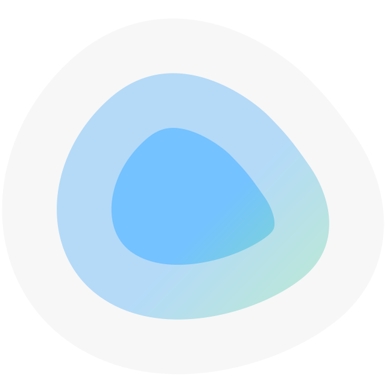

# Dockge

{: style="height:150px;width:150px"}

[](https://github.com/louislam/dockge)
[](https://github.com/louislam/dockge/releases/latest)
[](https://hub.docker.com/r/louislam/dockge/)

Стильный, простой и быстрый self-hosted менеджер Docker Compose менеджер. 


## ⭐ Возможности

- 🧑‍💼 Управление `compose.yaml` файлом
  - Создание/Редактирование/Запуск/Остановка/Перезапуск/Удаление
  - Обновление Docker образов
- ⌨️ Интерактивный редактор для `compose.yaml`
- 🦦 Интерактивный Web-терминал
- 🕷️ (1.4.0 🆕) Поддержка нескольких инстансов - Можно управлять несколькими стаками на разных Docker хостах через один интерфейс
- 🏪 Преобразование `docker run ...` команд в `compose.yaml`
- 📙 Файловая структура - Dockge не меняет изначальные файлы, они хранятся на диске как обычно. Можно взаимодействовать с ними, используя обычные `docker compose` команды 
- 🚄 Быстрый - Прогресс (Pull/Up/Down) и вывод терминала в режиме реального времени
- 🐣 Простой в использовании и стильный пользовательский интерфейс.

## 🔧 Установка

Требования:

- [Docker](https://docs.docker.com/engine/install/) 20+ / Podman
- (Podman only) podman-docker (Debian: `apt install podman-docker`)
- OS:
  - Основные дистрибутивы Linux могут запускать Docker/Podman, например:
     - ✅ Ubuntu
     - ✅ Debian (Bullseye или новее)
     - ✅ Raspbian (Bullseye или новее)
     - ✅ CentOS
     - ✅ Fedora
     - ✅ ArchLinux
- Arch: armv7, arm64, amd64 (a.k.a x86_64)

### Основы

- Папка хранения стеков: `/opt/stacks`
- Порт: 5001

```
# Create directories that store your stacks and stores Dockge's stack
mkdir -p /opt/stacks /opt/dockge
cd /opt/dockge

# Download the compose.yaml
curl https://raw.githubusercontent.com/louislam/dockge/master/compose.yaml --output compose.yaml

# Start the server
docker compose up -d

# If you are using docker-compose V1 or Podman
# docker-compose up -d
```

Dockge будет запущен по адресу http://localhost:5001

### Углубленный

```yaml
services:
  dockge:
    image: louislam/dockge:1
    restart: unless-stopped
    ports:
      # Host Port : Container Port
      - 5001:5001
    volumes:
      - /var/run/docker.sock:/var/run/docker.sock
      - ./data:/app/data
        
      # If you want to use private registries, you need to share the auth file with Dockge:
      # - /root/.docker/:/root/.docker

      # Stacks Directory
      # ⚠️ READ IT CAREFULLY. If you did it wrong, your data could end up writing into a WRONG PATH.
      # ⚠️ 1. FULL path only. No relative path (MUST)
      # ⚠️ 2. Left Stacks Path === Right Stacks Path (MUST)
      - /opt/stacks:/opt/stacks
    environment:
      # Tell Dockge where is your stacks directory
      - DOCKGE_STACKS_DIR=/opt/stacks
```

## Обновление

```bash
cd /opt/dockge
docker compose pull && docker compose up -d
```

## Скриншоты


