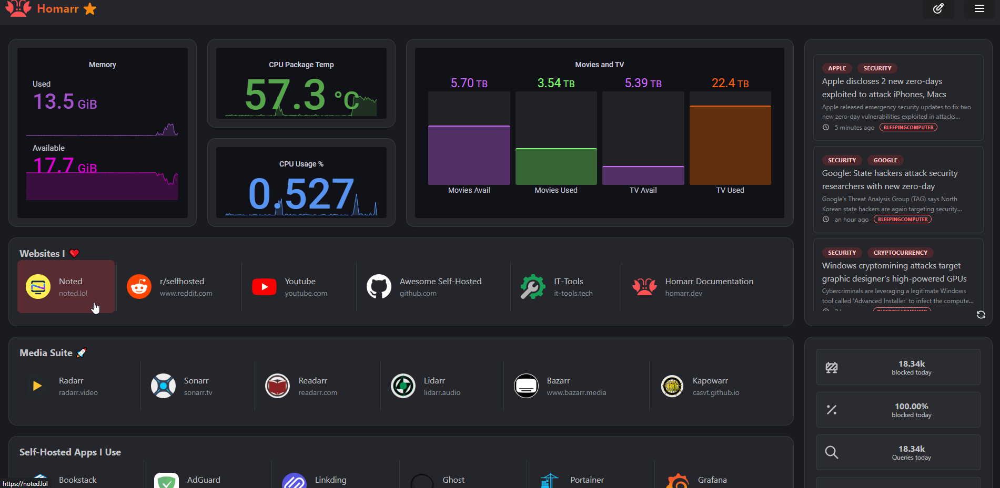

# Homarr - дашборд для быстрого доступа к сервисам. 

[](https://github.com/ajnart/homarr)
[](https://github.com/ajnart/homarr/releases/latest)
[](https://demo.homarr.dev/ru)

Современная панель управления домашней лабой. Позволяет видеть все, что поднято.



## Запуск через Docker

Запуск простой, через docker:

```bash
docker run  \
  --name homarr \
  --restart unless-stopped \
  -p 7575:7575 \
  -v <your-path>/homarr/configs:/app/data/configs \
  -v <your-path>/homarr/icons:/app/public/icons \
  -d ghcr.io/ajnart/homarr:latest
```

После, открываем [http://localhost:7575/](http://localhost:7575) в браузере и пользуемся.

## Запуск через Docker-Compose

Надо создать файл docker-compose.yml и вставить следующий код:

```yaml title="docker-compose.yml"
version: '3.9'
  homarr:
    container_name: homarr
    image: ghcr.io/ajnart/homarr:latest
    restart: unless-stopped
    volumes:
      - ./homarr/configs:/app/data/configs
      - ./homarr/icons:/app/public/icons
      - ./homarr/img:/app/public/img
    ports:
      - 7575:7575
      - EDIT_MODE_PASSWORD='strong_password'
```
Затем, запускаем через `docker-compose up -d ` находясь в той же папке, где файл.


## Возможности

- 🖌️ Широкие возможности настройки благодаря обширной системе перетаскивания сетки.
- ✨ Легко интегрируется с вашими любимыми автономными приложениями.
- 📌 Простое и быстрое управление приложениями — без использования YAML
- 🙊 Усовершенствованная система управления секретами для повышения безопасности
- 📄 Подробная документация и активное сообщество
- 🔍 Мгновенный поиск в Интернете или поддерживаемых интеграциях.
- 🏴 Football Football Result Следите за своей заявкой с помощью встроенной системы статуса.
- 🦞 Комплексный встроенный инструмент выбора значков, содержащий более 7000 значков.
- 🐳 Простое развертывание с помощью Docker, unRAID и Synology.
- 🚀 Совместимость с любым основным потребительским оборудованием (x86, Raspberry Pi, старые ноутбуки и т. д.)
- 💵 Бесплатность и открытый исходный код — ваши данные остаются на вашем устройстве. Нет данных телеметрии.