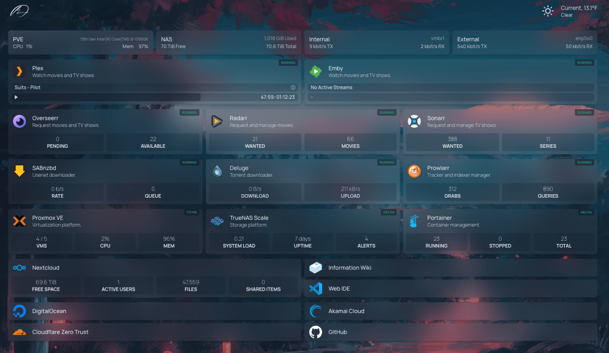

# Homepage

[](https://github.com/gethomepage/homepage)
[](https://github.com/gethomepage/homepage/releases/latest)

Современная, полностью статичная, быстрая, безопасная, полностью прокси-серверная, легко настраиваемая панель управления приложениями с интеграцией более чем 100 сервисов и переводом на несколько языков. Легко настраивается с помощью файлов YAML или с помощью обнаружения меток Docker.



## Запуск через Docker Compose

```yaml
version: "3.3"
services:
  homepage:
    image: ghcr.io/gethomepage/homepage:latest
    container_name: homepage
    environment:
      PUID: 1000 #-- optional, your user id
      PGID: 1000 #-- optional, your group id
    ports:
      - 3000:3000
    volumes:
      - /path/to/config:/app/config # Make sure your local config directory exists
      - /var/run/docker.sock:/var/run/docker.sock:ro # optional, for docker integrations
    restart: unless-stopped
```