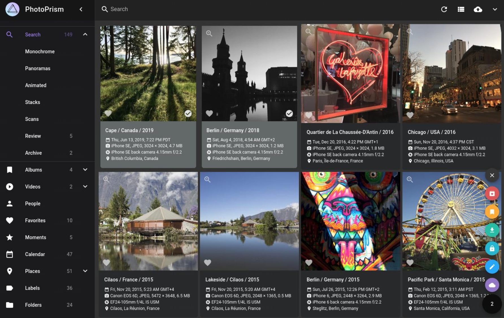

# Photoprism

[](https://github.com/photoprism/photoprism)
[](https://github.com/photoprism/photoprism/releases/latest)
[](https://hub.docker.com/r/photoprism/photoprism)

PhotoPrism® — это приложение для фотографий на базе искусственного интеллекта для [децентрализованной сети](https://en.wikipedia.org/wiki/Decentralized_web). Он использует новейшие технологии для автоматического пометки и поиска изображений, не мешая вам. Вы можете запустить его дома, на частном сервере или в облаке.



Чтобы получить первое впечатление, можно поиграться в [демо-версию](https://try.photoprism.app/).

## Установка

Устанавливать будем через Docker. Как обычно. 

!!! tip

    Настройка докера описывается в статье: [Установка Docker](install.md)

Создаем файл `docker-compose.yml`, используя команду:

```bash
nano docker-compose.yml
```
Заполняем новый файл:

```yaml
version: "3.7"
    
services:
  photoprism:
    container_name: photoprism
    image: photoprism/photoprism:latest
    restart: unless-stopped
    stop_grace_period: 10s
    depends_on:
      - mariadb
    security_opt:
      - seccomp:unconfined
      - apparmor:unconfined
    ports:
      - "2342:2342"
    environment:
      PHOTOPRISM_ADMIN_USER: $PHOTOPRISM_ADMIN_USER                 # admin login username
      PHOTOPRISM_ADMIN_PASSWORD: $PHOTOPRISM_ADMIN_PASSWORD        # initial admin password (8-72 characters)
      PHOTOPRISM_AUTH_MODE: "password"               # authentication mode (public, password)
      PHOTOPRISM_SITE_URL: $PHOTOPRISM_SITE_URL  # server URL in the format "http(s)://domain.name(:port)/(path)"
      PHOTOPRISM_DISABLE_TLS: "false"                # disables HTTPS/TLS even if the site URL starts with https:// and a certificate is available
      PHOTOPRISM_DEFAULT_TLS: "true"                 # defaults to a self-signed HTTPS/TLS certificate if no other certificate is available
      PHOTOPRISM_ORIGINALS_LIMIT: 5000               # file size limit for originals in MB (increase for high-res video)
      PHOTOPRISM_HTTP_COMPRESSION: "gzip"            # improves transfer speed and bandwidth utilization (none or gzip)
      PHOTOPRISM_LOG_LEVEL: "info"                   # log level: trace, debug, info, warning, error, fatal, or panic
      PHOTOPRISM_READONLY: "false"                   # do not modify originals directory (reduced functionality)
      PHOTOPRISM_EXPERIMENTAL: "false"               # enables experimental features
      PHOTOPRISM_DISABLE_CHOWN: "false"              # disables updating storage permissions via chmod and chown on startup
      PHOTOPRISM_DISABLE_WEBDAV: "false"             # disables built-in WebDAV server
      PHOTOPRISM_DISABLE_SETTINGS: "false"           # disables settings UI and API
      PHOTOPRISM_DISABLE_TENSORFLOW: "false"         # disables all features depending on TensorFlow
      PHOTOPRISM_DISABLE_FACES: "false"              # disables face detection and recognition (requires TensorFlow)
      PHOTOPRISM_DISABLE_CLASSIFICATION: "false"     # disables image classification (requires TensorFlow)
      PHOTOPRISM_DISABLE_VECTORS: "false"            # disables vector graphics support
      PHOTOPRISM_DISABLE_RAW: "false"                # disables indexing and conversion of RAW images
      PHOTOPRISM_RAW_PRESETS: "false"                # enables applying user presets when converting RAW images (reduces performance)
      PHOTOPRISM_JPEG_QUALITY: 85                    # a higher value increases the quality and file size of JPEG images and thumbnails (25-100)
      PHOTOPRISM_DETECT_NSFW: "false"                # automatically flags photos as private that MAY be offensive (requires TensorFlow)
      PHOTOPRISM_UPLOAD_NSFW: "true"                 # allows uploads that MAY be offensive (no effect without TensorFlow)
      # PHOTOPRISM_DATABASE_DRIVER: "sqlite"         # SQLite is an embedded database that doesn't require a server
      PHOTOPRISM_DATABASE_DRIVER: "mysql"            # use MariaDB 10.5+ or MySQL 8+ instead of SQLite for improved performance
      PHOTOPRISM_DATABASE_SERVER: "mariadb:3306"     # MariaDB or MySQL database server (hostname:port)
      PHOTOPRISM_DATABASE_NAME: "photoprism"         # MariaDB or MySQL database schema name
      PHOTOPRISM_DATABASE_USER: "photoprism"         # MariaDB or MySQL database user name
      PHOTOPRISM_DATABASE_PASSWORD: $MARIADB_PASSWORD     # MariaDB or MySQL database user password
      PHOTOPRISM_SITE_CAPTION: "AI-Powered Photos App"
      PHOTOPRISM_SITE_DESCRIPTION: ""                # meta site description
      PHOTOPRISM_SITE_AUTHOR: ""                     # meta site author
      ## Video Transcoding (https://docs.photoprism.app/getting-started/advanced/transcoding/):
      # PHOTOPRISM_FFMPEG_ENCODER: "software"        # H.264/AVC encoder (software, intel, nvidia, apple, raspberry, or vaapi)
      # PHOTOPRISM_FFMPEG_SIZE: "1920"               # video size limit in pixels (720-7680) (default: 3840)
      # PHOTOPRISM_FFMPEG_BITRATE: "32"              # video bitrate limit in Mbit/s (default: 50)
      ## Run/install on first startup (options: update https gpu tensorflow davfs clitools clean):
      # PHOTOPRISM_INIT: "https gpu tensorflow"
      ## Run as a non-root user after initialization (supported: 0, 33, 50-99, 500-600, and 900-1200):
      # PHOTOPRISM_UID: 1000
      # PHOTOPRISM_GID: 1000
      # PHOTOPRISM_UMASK: 0000
    user: "1000:1000"
    working_dir: "/photoprism" # do not change or remove
    ## Storage Folders: "~" is a shortcut for your home directory, "." for the current directory
    volumes:
      # "/host/folder:/photoprism/folder"                # Example
      - ./photoprism/originals:/photoprism/originals     
      - ./photoprism/storage:/photoprism/storage
      - ./photoprism/import:/photoprism/import
      # - "/example/family:/photoprism/originals/family" # *Additional* media folders can be mounted like this

  ## Database Server (recommended)
  ## see https://docs.photoprism.app/getting-started/faq/#should-i-use-sqlite-mariadb-or-mysql
  mariadb:
    container_name: mariadb
    image: mariadb:11
    ## If MariaDB gets stuck in a restart loop, this points to a memory or filesystem issue:
    ## https://docs.photoprism.app/getting-started/troubleshooting/#fatal-server-errors
    restart: unless-stopped
    stop_grace_period: 5s
    security_opt: # see https://github.com/MariaDB/mariadb-docker/issues/434#issuecomment-1136151239
      - seccomp:unconfined
      - apparmor:unconfined
    command: --innodb-buffer-pool-size=512M --transaction-isolation=READ-COMMITTED --character-set-server=utf8mb4 --collation-server=utf8mb4_unicode_ci --max-connections=512 --innodb-rollback-on-timeout=OFF --innodb-lock-wait-timeout=120
    ## Never store database files on an unreliable device such as a USB flash drive, an SD card, or a shared network folder:
    volumes:
      - "./database:/var/lib/mysql" # DO NOT REMOVE
    environment:
      MARIADB_AUTO_UPGRADE: "1"
      MARIADB_INITDB_SKIP_TZINFO: "1"
      MARIADB_DATABASE: "photoprism"
      MARIADB_USER: "photoprism"
      MARIADB_PASSWORD: $MARIADB_PASSWORD
      MARIADB_ROOT_PASSWORD: $MARIADB_ROOT_PASSWORD
```

Создаем файл, где будут описаны переменные: 

```bash
cp .env
```
Нужно заполнить его:
```
PHOTOPRISM_ADMIN_USER=admin           # Имя админа
PHOTOPRISM_ADMIN_PASSWORD=password    # пароль админа
PHOTOPRISM_SITE_URL=http://site.name  # URL сайта, для доступа
MARIADB_ROOT_PASSWORD=strong-password # Пароль root от БД mariadb
MARIADB_PASSWORD=strong-password1     # Пароль от юзера photoprism БД
```
