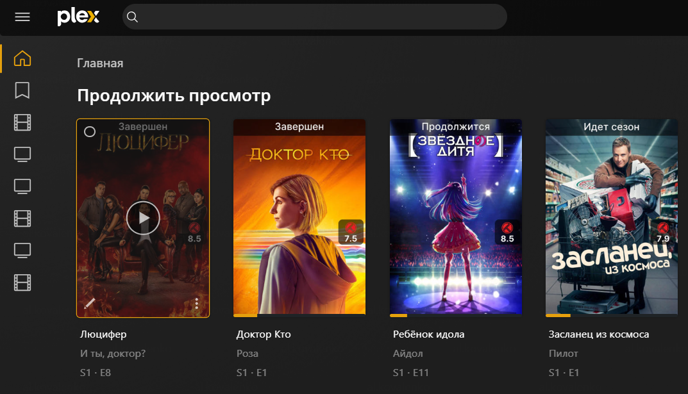

# Plex in Docker

[](https://github.com/plexinc/pms-docker)
[](https://hub.docker.com/r/plexinc/pms-docker/)

[Plex](https://www.plex.tv/) — это клиент-серверная система медиаплеера и пакет программного обеспечения, состоящий из двух основных компонентов (медиа-сервера и клиентских приложений).



## Требования для запуска

!!! summary "Уже работает"

    * [Traefik](../traefik/index.md) настроен согласно инструкциям
    * Запись DNS для имени хоста, которое вы собираетесь использовать (или подстановочный знак ), указывающая на ваш поддерживаемый IP-адрес .


## Подготовка

### Папка

Для запуска контейнера, нужен будет каталог, где Plex сможет хранить свои данные:

```
mkdir /opt/appdata/plex
```
### Использование Docker macvlan (опционально)

Если нужно сделать так, чтобы у докера был свой отдельный IP адрес в домашней локальной сети, то нужно будет использовать macvlan Docker. Контейнеры в macvlan будут думать, что они находятся на отдельном ПК в локальной сети.

Для настройки, нужно добавить блок кода 

```yaml

dockervlan:
  name: dockervlan
  driver: macvlan
  driver_opts:
    parent: eth1 # using ifconfig
  ipam:
    config:
      - subnet: "192.168.1.0/24"
        ip_range: "192.168.1.250/32"
        gateway: "192.168.1.1"
```

Моя домашняя сеть находится в подсети **192.168.1.X**. Я захотел сделать так, чтобы у Plex, был свой IP-адрес, а не IP-адрес сервера с кучей контейнеров. Разберем, что значат строчки, из кода выше.

- **eth1** - это имя используемого сетевого интерфейса. Вы можете найти это с помощью команды `ifconfig` или `ip a`.
- Далее назначаем конфиг. **192.168.1.250/32** - таким образом будет только 1 IP в подсети. Если нужно больше, то сменить маску подсети (записывается после `/`)

### Файл .env

Далее создадим `.env` файл, где будут храниться переменные. Для **PUID** и **PGID** нужно задать **UID** и **GID** пользователя системы, которому принадлежат права на медиафайлы в локальной файловой системе.

```yaml title=".env"
VERSION=latest
PUID=1001
PGID=1001
PLEX_CLAIM=
```

### Plex Claim

Не забываем прописать `PLEX_CLAIM` - параметр нужен, чтобы привязать этот экземпляр медиасервера к учетной записи Plex. Получить можно по ссылке: [https://www.plex.tv/claim](https://www.plex.tv/claim)

### Docker Compose для Plex

Ниже приведен файл Docker Compose, рекомендованный для начала работы с Plex. 

```yaml title="docker-compose.yml"
version: "3.7"

networks:
  default:
    driver: bridge

services:
  plex:
    container_name: plex
    image: plexinc/pms-docker:latest
    restart: unless-stopped
    networks:
      - default
    #devices:
    # - /dev/dri:/dev/dri # for harware transcoding
    ports:
      - "32400:32400"
      - "32400:32400/udp"
    security_opt:
      - no-new-privileges:true
    volumes:
      - /opt/appdata/plex:/config
      - /opt/appdata/plex/temp:/transcode
      - /mnt:/mnt:ro
    environment:
      - ADVERTISE_IP="http://172.18.1.250:32400/"
      - PUID=$PUID
      - PGID=$PGID
      - TZ=$TZ
      - VERSION=docker
      - PLEX_CLAIM=$PLEX_CLAIM
```

Разберем, что значат некоторые параметры в файле:

- Мы используем образ докера **plexinc/pms-docker:public** Plex. Вы также можете использовать изображение **plexpass** , которое предлагает некоторые преимущества вместо **public** . Благодаря поддержке Plex на серверах Raspberry Pi Docker (ARM), [образ Plex Linuxserver.io](https://github.com/linuxserver/docker-plex) также является хорошим.
- Plex будет принадлежать к сети типа мост "default". Это нормально для большинства пользователей.
- Мы также сопоставляем несколько портов контейнера Plex (правая часть двоеточия) с хостом Docker (слева от двоеточия). Plex будет доступен на IP-адресе хоста Docker через порт Plex Docker 32400. Например, мой хост Docker имеет IP-адрес **192.168.1.100** . Итак, Plex будет доступен по адресу `http://192.168.1.100:32400`.
- `/dev/dri` обычно представляет собой видеокарту. Вы можете передать видеокарту вашего хоста докера в контейнер докера Plex для аппаратного перекодирования. Раскомментируйте эти строки (удалите # впереди), чтобы включить видеокарты. Вам придется включить аппаратное перекодирование в настройках Plex. Это особенно полезно для NAS, поддерживающих Plex (например, Synology).
- В разделе `volumes` мы сопоставляем постоянный том для конфигурации Plex, еще один том, на котором находится наша медиабиблиотека. Вы можете сделать его доступным только для чтения, добавив `:ro` в конце. 
- С помощью `$PUID` и `$PGID` мы указываем, что Plex запускается с идентификатором пользователя и группой пользователей, которые мы определили ранее в файле `.env`.
- `ADVERTISE_IP` настраивает URL-адреса доступа к пользовательскому серверу в настройках сети сервера Plex. Он указывает другие IP-адреса, по которым можно получить доступ к тому же серверу Plex.
- `ALLOWED_NETWORKS`: предназначено исключительно для регулирования пропускной способности. Указанные здесь IP-адреса считаются локальными (LAN) сетями.

### Настройка сети

В приведенном выше файле Docker Compose используется сеть **default**. Если нужно использовать сеть macvlan, то нужно заменить блок `networks`:

```yaml
    networks:
      dockervlan:
        ipv4_address: 192.168.1.250 
```

!!! warning

    Обратите внимание, что указанный IP-адрес такой же, как тот, который мы настроили ранее в этом руководстве. Plex должен быть доступен по адресу **http://192.168.1.250:32400**.

### Запуск Plex

После настройки файле Docker Compose пришло время запустить Plex с помощью команды:

```bash
sudo docker compose -f ~/docker/docker-compose.yml up -d
```
Если все будет хорошо, то через пару минут станет доступна страница в браузере, по URL адресу, перечсиленному ранее.

## Доступ к Plex через интернет

Доступ из домашней сети это хорошо, но что делать, когда хочется пользоваться не только дома. Самое простое - перенаправить порт 32400 на роутере, чтобы он указывал на IP-адрес сервера Plex (тот же что и `ADVERTISE_IP`, определенный ранее)

### Использование обратного прокси

Другой безопасный способ доступа к Plex - использовать обратный прокси. Но для этого нужно доменное имя или DDNS.

Можно использовать NGINX или Traefik. NGINX прост в настройке, но не гибок. Я рекомендую [Traefik](../traefik/index.md).

## Полезные команды

### Удаление мусора из PhotoTranscoder

Часто бывает так, что папка `../Library/Application Support/Plex Media Server/Cache/PhotoTranscoder` начинает занимать очень много места. в ней хранится весь кеш из изображений. Разные версии превью - все тут. Надо как-то почистить старое, чтобы освободить место:

```bash
find "/home/plex/plexconfig/Library/Application Support/Plex Media Server/Cache/PhotoTranscoder" -name "*.jpg" -type f -mtime +5 -delete
```