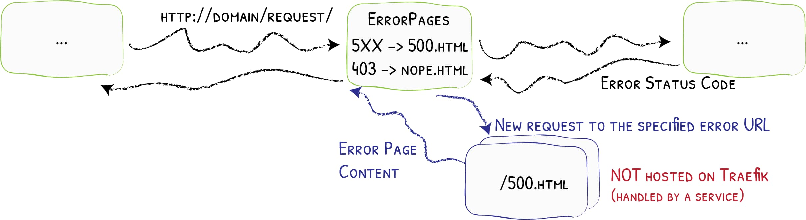

# Настройка страницы в Traefik 2

## Промежуточное программное обеспечение ErrorPage

Traefik поставляется с готовым [middlewares error](https://docs.traefik.io/middlewares/errorpages/). Его обязанность — возвращать пользовательскую страницу вместо страницы по умолчанию в соответствии с настроенными диапазонами кодов состояния HTTP. Вот пример:


```yaml
# Dynamic Custom Error Page for 4XX/5XX Status Code
labels:
  - "traefik.http.middlewares.test-errorpage.errors.status=400-599"
  - "traefik.http.middlewares.test-errorpage.errors.service=serviceError"
  - "traefik.http.middlewares.test-errorpage.errors.query=/{status}.html"
```

Как указано в официальной документации:

- **status** — это статус HTTP, который вызывает страницу с ошибкой (в этом примере каждый код между 400 и 599).
- `serviceError` - это **служба** , которая будет обслуживать новую запрошенную страницу ошибки
- **запрос** — URL-адрес страницы ошибки (размещенной на сервисе), где `{status}` в запросе будет заменен полученный код состояния.

Стоит отметить, что страницы ошибок не размещаются непосредственно на Traefik, необходимо размещать их на своем веб-сервере. На следующем рисунке из документации Traefik показан пример этого сценария.



## Рабочий сценарий
Промежуточное ПО ErrorPage - это то что нам нужно. Но как мы можем использовать его для обслуживания наших страниц и ошибок в целом?

Представьте, что вы хотите обслуживать глобальную страницу для URL-адресов, которые указывают на ваш хост, но не привязаны к определенным службам. Например, если у вас есть запись DNS, которая соответствует таким запросам, как:

```
*.example.com
```

URL-адреса, такие как:

```
http://bla-bla.example.com
```

попадут в ваш Traefik, но ни один маршрутизатор не справится с ними. В таких случаях мы хотим, чтобы Traefik вернул нашу классную кастомную страницу ошибки.

Как мы можем это настроить? Начнем с этого чертежа:


**В двух словах:** мы определяем правило **универсального маршрутизатора с низким приоритетом** , которое сработает только в том случае, если другие маршрутизаторы для определенных служб не могут обработать запрос. Затем такой неизвестный запрос обрабатывается **промежуточным программным обеспечением ErrorPage**, которое сообщает **Nginx** об обслуживании страницы с ошибкой.


## Практика
Пришло время практики. Будем считать, что у нас же есть работающий Traefik 2, запущенный через `docker-compose`. Добавим в нему `nginx` с нашими страничками ошибок и тестовый контейнер `whoami` для проверки работы:

??? note
    ```yaml title="docker-compose.yml"
    version: "3.9"

    networks:
      traefik_net:
        external: true

    services:

    # Traefik 2 - Reverse Proxy
      traefik:
        container_name: traefik
        image: traefik:2.10
        restart: always
        security_opt:
          - no-new-privileges:true
        command: # CLI arguments
          - --api.dashboard=true
          - --providers.docker.network=traefik_net
          - --entrypoints.webinsecure.address=:80
          - --providers.docker.exposedByDefault=false
          - --providers.docker=true    
        networks:
          - traefik_net
        ports:
          - "80:80"
        volumes:
          - /var/run/docker.sock:/var/run/docker.sock:ro
        labels:
          traefik.enable: true
          ## Dashboard
          traefik.http.routers.traefik.entrypoints: http
          traefik.http.routers.traefik.rule: host('traefik.localhost')
          traefik.http.routers.traefik.service: api@internal

      nginx-error:
        image: nginx:latest
        volumes:
          - ./error-pages:/usr/share/nginx/error-pages
          - ./nginx/default.conf:/etc/nginx/conf.d/default.conf
        network:
          - traefik_net
        labels:
          traefik.enable: true
          traefik.http.routers.error-rtr.rule: HostRegexp(`{host:.+}`)
          traefik.http.routers.error-rtr.priority: 1
          traefik.http.routers.error-rtr.entrypoints: webinsecure
          traefik.http.routers.error-rtr.middlewares: error-pages-middleware

          traefik.http.middlewares.error-pages-middleware.errors.status: 400-599
          traefik.http.middlewares.error-pages-middleware.errors.service: error-pages-service
          traefik.http.middlewares.error-pages-middleware.errors.query: /{status}.html

          traefik.http.services.error-pages-svc.loadbalancer.server.port: 80

      test-app:
        image: containous/whoami
        networks: 
          - traefik_net
        labels:
          traefik.enable: true
          traefik.http.routers.error-rtr.rule: host('test.localhost')
          traefik.http.routers.error-rtr.entrypoints: webinsecure
          traefik.http.services.error-pages-svc.loadbalancer.server.port: 80
    ```

В приведенном compose файле содержится все, что нам нужно для отображения кастомных страниц ошибок. Страницы ошибок находятся в службе Docker `nginx-error`, которая управляет контейнером **Nginx**, предназначенным для страниц ошибок.

Все начинается с `error-router`:

```yaml 
labels:
  traefik.http.routers.error-rtr.rule: HostRegexp(`{host:.+}`)
  traefik.http.routers.error-rtr.priority: 1
  traefik.http.routers.error-rtr.entrypoints: webinsecure
```
Ему присвоен [приоритет](https://doc.traefik.io/traefik/routing/routers/#priority) `1`, поэтому он перехватывает все запросы , если они не были обработаны ранее другими (т.е. `traefik.http.routers.traefik` и `traefik.http.routers.my-test-app`).

Затем прикрепляем к нему `error-pages-middleware`:

```yaml 
labels:
  traefik.http.routers.error-rtr.middlewares: error-pages-middleware
```

это фактическое промежуточное программное обеспечение ErrorPage Traefik:

```yaml
labels:
  traefik.http.middlewares.error-pages-middleware.errors.status: 400-599
  traefik.http.middlewares.error-pages-middleware.errors.service: error-pages-svc
  traefik.http.middlewares.error-pages-middleware.errors.query: /{status}.html

  traefik.http.services.error-pages-service.loadbalancer.server.port: 80
```

Такое промежуточное программное обеспечение запросит `error-pages-svc` обслуживание наших кастомных страниц ошибок.

Пара слов о **папках Nginx**. В этом примере мы связываем монтирование (но мы также можем скопировать файлы в контейнер) двух основных томов:
```yaml
volumes:
  - ./error-pages:/usr/share/nginx/error-pages
  - ./nginx/default.conf:/etc/nginx/conf.d/default.conf
```
В этой папке ``./error-pages` мы храним файлы страниц ошибок, такие как наши собственные файлы `404.html`. Кроме того, мы настраиваем конфигурацию этого экземпляра Nginx следующим образом `default.conf`:

```nginx
server {
    listen       80;
    server_name  localhost;

    error_page  404    /404.html;
    # other error pages here:
    # error_page  403    /403.html;

    location / {
        root  /usr/share/nginx/error-pages;
        internal;
    }
}
```
## Проверка работы

Пришло время запустить наши контейнеры и проверить их работу.

Если вы запросите: `http://traefik.localhost/` или `http://test.localhost/` вы получите панель управления Traefik и выходные данные whoami соответственно.

Если вы попытаетесь получить: `http://bla-bla.localhost`, Traefik вернет именно вашу дружественную страницу с ошибкой 404 (т. е. `404.html`).

!!! tip
    Обратите внимание: если вы заинтересованы в **управлении ошибками таким же образом и для определенных служб, вы можете использовать промежуточное программное обеспечение ErrorPage**. 
    Например, вы можете подключить промежуточное программное обеспечение к маршрутизатору панели управления Traefik следующим образом:
    ```yaml 
    labels:
      # Dashboard
      traefik.http.routers.traefik.rule: Host(`traefik.localhost`)
      traefik.http.routers.traefik.service: api@internal
      traefik.http.routers.traefik.entrypoints: webinsecure
      # Attach the error middleware also to this router
      traefik.http.routers.traefik.middlewares: error-pages-middleware
    ```
    Теперь, если вы запросите: `http://traefik.localhost/bla-bla`, вы снова получите настроенную страницу ошибки 404.

---

[Middlewares ErrorPage](https://docs.traefik.io/middlewares/errorpages/)
Интересная ветка на эту тему на форуме сообщества Containous.
[Статические страницы ошибок сервера в образе Docker](https://github.com/tarampampam/error-pages) (также готовы для Traefik)