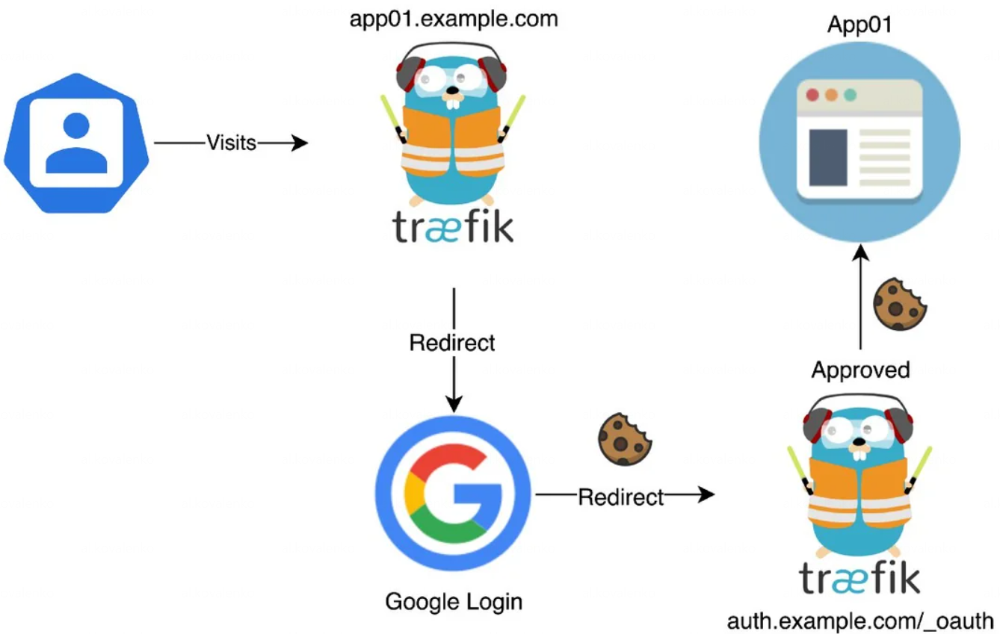
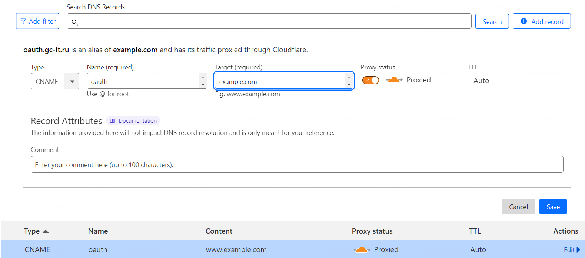
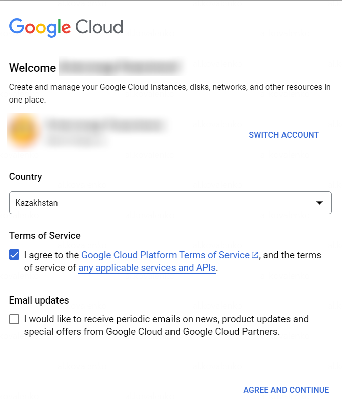
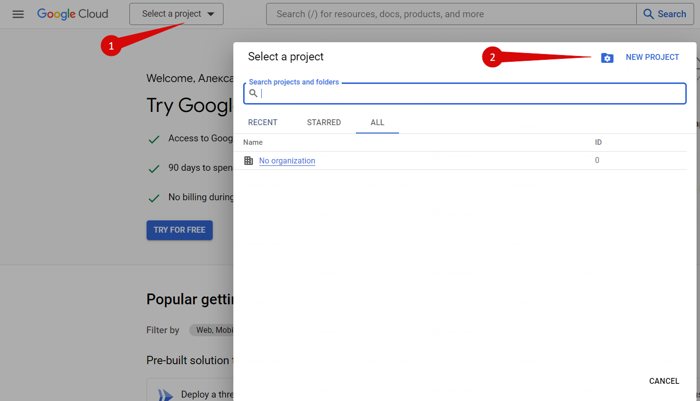
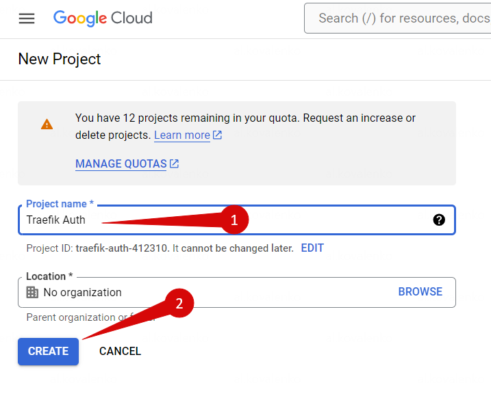
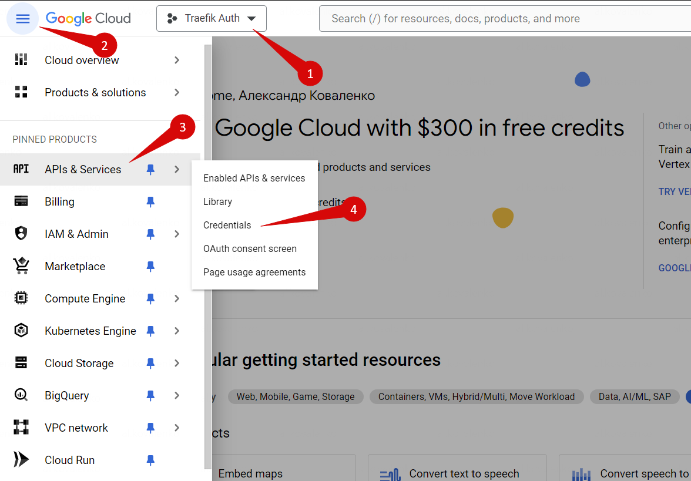
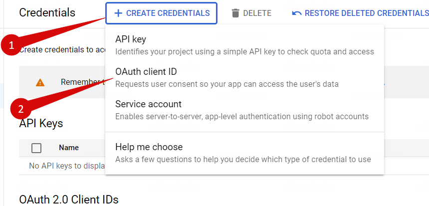
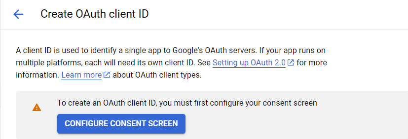
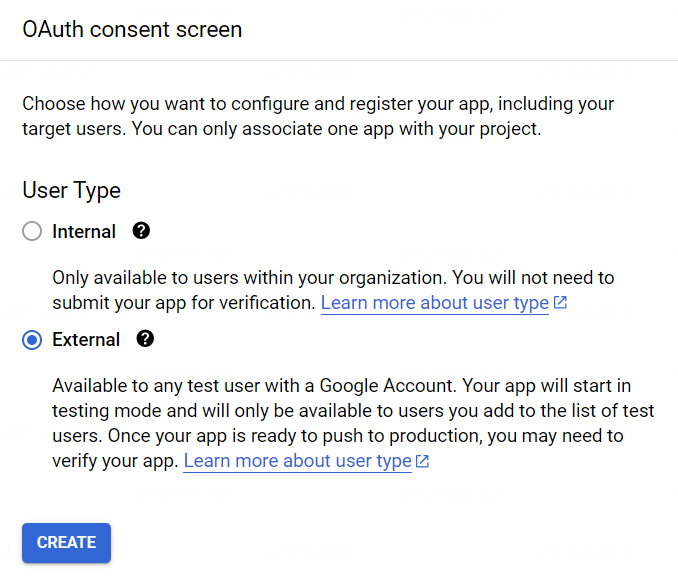
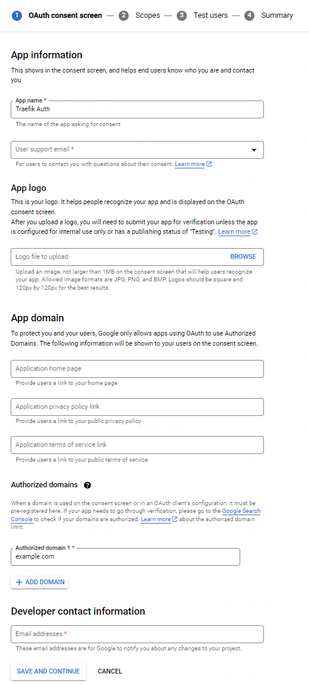

# Traefik Forward Auth

[](https://github.com/thomseddon/traefik-forward-auth)
[](https://github.com/thomseddon/traefik-forward-auth/releases/latest)


-   Бесшовно накладывает любой http-сервис на одну конечную точку (см.: `url-path`в [разделе «Конфигурация](https://github.com/thomseddon/traefik-forward-auth#configuration) ») .
-   Поддерживает несколько поставщиков, включая Google и OpenID Connect (поддерживается Azure, Github, Salesforce и т. д.).
-   Поддерживает несколько доменов/поддоменов, динамически генерируя redirect\_uri
-   Позволяет выборочно применять/обходить аутентификацию на основе параметров запроса (см `rules`. [Конфигурация](https://github.com/thomseddon/traefik-forward-auth#configuration) )
-   Поддерживает использование централизованной аутентификации host/redirect\_uri (см `auth-host`. [Конфигурация](https://github.com/thomseddon/traefik-forward-auth#configuration) )
-   Позволяет сохранять аутентификацию в нескольких доменах (см. [Домены cookie](https://github.com/thomseddon/traefik-forward-auth#cookie-domains) )
-   Поддерживает расширенную аутентификацию за пределами срока действия токена Google (см.: `lifetime`в разделе [«Конфигурация](https://github.com/thomseddon/traefik-forward-auth#configuration) »).

## Применение c Google OAuth

Google SSO выбран, как один из самых простых способов сделать доступными и защитить домашние сервисы. Процесс настройки прост. Из минусов можно выделить, что не будет гибкого управления пользователями - нет ограничения доступа по ресурсам. Я понимаю, что самое простое, это сделать авторизацию при помощи `.htpasswd` файла. Для одной службы это норм, но когда служб много - вводить каждый раз логин и пароль может быть утомительным. 

После внедрения **Traefik Forward Auth** нужно будет входить в систему только один раз. А добавив _Google OAuth_, можно настроить двухфакторную аутентификацию (2FA), что делает домашние сервисы более защищенными, нежели использование файла `.htpasswd`.

Для тех кто не хочет отдавать авторизацию в руки гугла и хочет что-то свое - смотрите в сторону **Authelia**, **Keycloak** или **Authentik**. Я использовал все 3 проекта для авторизации и остановился на **Authentik**. 

## Что за OAuth?

**OAuth** — открытый протокол (схема) [авторизации](https://ru.wikipedia.org/wiki/%D0%90%D0%B2%D1%82%D0%BE%D1%80%D0%B8%D0%B7%D0%B0%D1%86%D0%B8%D1%8F "Авторизация"), обеспечивающий предоставление третьей стороне ограниченный доступ к защищённым ресурсам пользователя без передачи ей (третьей стороне) логина и пароля - [Wikipedia](https://ru.wikipedia.org/wiki/OAuth)

Вход и аутентификация Google OAuth для Traefik действует как посредник для ваших служб, разрешая или запрещая доступ после проверки авторизованного файла cookie в вашем браузере. Процесс выглядит примерно так:

1.  Для нашего хоста сделан  **запрос**  (например, https://traefik.example.com)
2.  Запрос направляется нашим провайдером DNS на наш IP-адрес WAN, где порты 80 и 443 перенаправляются в контейнер Traefik.
3.  Traefik видит входящий запрос и распознает, что  **Forward Auth**  определен в  **метках**  для этого хоста, поэтому запрос перенаправляется в контейнер  **Traefik Forward Auth**.
4.  Затем контейнер проверяет, есть ли в браузере авторизованный файл cookie. Если файл cookie отсутствует, запрос отправляется на  **сервер авторизации Google OAuth2**.
5.  После успешного входа в Google запрос отправляется на  **URI перенаправления**, указанный для  **веб-приложения**  (https://oauth.example.com/_oauth).
6.  Затем авторизованный файл cookie сохраняется в браузере, и пользователь отправляется во внутреннюю службу.

В следующий раз, когда этот браузер попытается получить доступ к службе, защищенной входом и аутентификацией на основе OAuth, файл cookie будет распознан, и пользователь будет перенаправлен на их службу без запроса на вход.



Процесс происходит очень быстро и как только ваш браузер получит файл cookie, вы забудете, что включили Google OAuth с Traefik.

!!! note "Примечание"

    Образ Traefik Forward Auth использует  [**OpenID** **Connect**](https://en.wikipedia.org/wiki/OpenID_Connect) (**OIDC**),который представляет собой уровень аутентификации поверх протокола  [OAuth 2.0](https://en.wikipedia.org/wiki/OAuth#OAuth_2.0 "OAuth"). Образ Docker, представленный в этом руководстве, поддерживает Google, а также  [других поставщиков OIDC](https://github.com/thomseddon/traefik-forward-auth/wiki/Provider-Setup).

Процесс настройки Google OAuth для Traefik можно разделить на 3 этапа:

1.  создание записей DNS
2.  настройку службы Google OAuth
3.  изменение файлов docker compose и добавление меток Traefik для активации прямой аутентификации.

## Этап 1. Создание записи DNS

Для начала, создадим новую запись DNS для нашей службы OAuth (Google перенаправит на этот адрес после аутентификации), выбираем тип CNAME. Для примера, используем домменое имя  **example.com**.

Устанавливаем запись DNS как **oauth.example.com**. На рисунках ниже показан скриншот из Cloudflare.



Если есть запись CNAME с подстановочными знаками, указывающую на ваш корневой домен, то можно пропустить этот шаг.

## Этап 2. Настройка службы Google OAuth2

После создания записи DNS, переходим к настройке Google OAuth.

### Этап 2.1. Создаём проект Google.

Нам нужно создать  **проект Google**, который будет содержать наше **веб-приложение**, **экран согласия** и **учетные данные**.

Перейдем в [Google Cloud Developers Console](https://console.developers.google.com/). Затем проверим, что вошли в правильный аккаунт Google, который хотим использовать (обычно это будет адрес электронной почты).

!!! note "Примечание"

    Рекомендую выйти из других активных аккаунтов Google, чтобы быть уверенным, что на каждом этапе используется правильный аккаунт.

При появлении запроса нужно будет согласиться с  **Условиями использования Google Cloud Platform**, чтобы использовать их API.



Сервис OAuth от Google можно использовать бесплатно, поэтому **отказываемся** от бесплатной пробной версии. Нажимаем «**Select a project**» и «**New project**».



Введим уникальное имя для идентификации проекта, например  **Traefik Auth**. Далее нажимаем **Create**.



### Этап  2.2. Создайте учетные данные OAuth

Теперь, когда наш проект создан, нам нужно создать идентификатор клиента и секрет клиента, чтобы пройти аутентификацию в Google. Выберите наш проект  **Traefik Authentication**  и в меню навигации выберите  **APIs & Services > Credentials**. Нажмите  **Create Credentials > OAuth client ID**.





### Этап 2.3. Настройте Consent Screen

После того, как выбираем **OAuth Client ID**, вы увидите примечание о настройке **consent screen**, как показано ниже. Перед продолжением необходимо настроить **consent screen**.



Если автоматический запрос не появится, надо выбрать  **OAuth consent screen**  на левой панели.

Далее выбераем тип пользователей приложения: **External** и нажимаем **Create**.



Вводим имя своего приложения, например **Traefik Auth**, затем в разделе  **Authorized domains**  вводим свой домен, например **example.com**. Обязательно нажимаем **Enter**.



После нажатия кнопки **Save and Continue**  перейдем на следующий шаг. Далее везде нажимаем снизу **Save and Continue**.

### Этап 2.4. Создайте идентификатор клиента OAuth

Выбераем наш проект **Traefik Auth**, далее в меню навигации переходим по пути  **APIs & Services > Credentials**. Нажимаем **Create Credentials > OAuth client ID**.

Теперь выберите тип  **Web Application**  и вводим имя для своего веб-приложения, например, **Traefik**. Кроме того, потребуется ввести  **Authorized redirect URI** в виде  _https://oauth.example.com/_oauth_. Убедитесь, что нажата  **Enter**, чтобы добавить его, а затем нажмем  **Save**.

!!! note "Примечание"

    Разрешено добавлять только  **URI перенаправления**, которые ведут на наши **авторизованные домены**. В случае проблемы, нужно вернутся к странице **OAuth consent screen**

Скопируйте и сохраните  **client ID**  и  **client secret**. Их нужно будет использовать на следующем шаге.

## Этап 3. Настройка аутентификации Traefik с помощью OAuth2

Теперь, когда учетные данные OAuth настроены, нужно полготовить контейнер OAuth.

Обязательно нужно остановить контейнер [Traefik](index.md) и поправить файл `docker-compose.yml`, добавив метки Traefik и контейнер OAuth, как описано ниже.

### Этап 3.1. Создание middlewares - Traefik Auth

Пришло время создать новый файл `middlewares-oauth.yml` и добавьте следующие строки:

```yaml
http:
  middlewares:
    middlewares-oauth:
      forwardAuth:
        address:  "http://oauth:4181"  # Указать название сервиса OAuth, как задано в файле docker-compose.yml
        trustForwardHeader:  true
        authResponseHeaders:
          - "X-Forwarded-User"
    chain-oauth:
      chain:
        middlewares:
         - middlewares-oauth
```

Сохраняем файл и выходим из редактирования.

### Этап 3.2: Контейнер OAuth Forwarder

Пример файла `docker-compose.yml`

```yaml title="Пример файла docker-compose.yml"
version: "3.9"

services:
  traefik-forward-auth:
    image: thomseddon/traefik-forward-auth
    container_name: traefik-forward-auth
    restart: always
    environment:
      - DEFAULT_PROVIDER=oidc
      # Keycloak Section
      #- PROVIDERS_OIDC_ISSUER_URL=https://auth.example.com/auth/realms/traefik #for keycloak
      #- PROVIDERS_OIDC_CLIENT_ID=$PROVIDERS_OIDC_CLIENT_ID
      #- PROVIDERS_OIDC_CLIENT_SECRET=$PROVIDERS_OIDC_CLIENT_SECRET
      # Google OAuth
      - PROVIDERS_GOOGLE_CLIENT_ID=your-client-id
      - PROVIDERS_GOOGLE_CLIENT_SECRET=your-client-secret
      - SECRET=secret #replace
      - LOG_LEVEL=warn
      - WHITELIST=your-email-google
    labels:
      - "traefik.enable=true"
      - "traefik.http.middlewares.traefik-forward-auth.forwardauth.address=http://traefik-forward-auth:4181"
      - "traefik.http.middlewares.traefik-forward-auth.forwardauth.authResponseHeaders=X-Forwarded-User"
      - "traefik.http.services.traefik-forward-auth.loadbalancer.server.port=4181"
```

Теперь более подробнее что и как заполнять:

- **your-client-id** и **your-client-secret**: полученные ранее в этом руководстве по Traefik Oauth2.
- **secret**: используется для подписи файла cookie и должен быть случайным. Создайте случайный секрет с помощью: `openssl rand -hex 16`
- **your-email-google**: используется для указания, кто может получить доступ. Формат электронной почты.

!!! note

    Более полный файл [docker-compose.yml](https://github.com/thomseddon/traefik-forward-auth/blob/master/examples/traefik-v2/swarm/docker-compose.yml) или [kubernetes/simple-separate-pod](https://github.com/thomseddon/traefik-forward-auth/blob/master/examples/traefik-v2/kubernetes/simple-separate-pod/) можно найти в каталоге примеров

### Этап 3.3: Добавление Google OAuth для служб Docker

Возьмем пример панели инструментов Traefik 2. Нужно сделать так, чтобы доступ к панели осущесвлялся только через авторизацию Google OAuth2:

Указываем для службы в файле `docker-compose` следующие строки:


```yaml
    labels:
      - "traefik.enable=true"
      ## Middlewares
      - "traefik.http.routers.heimdall-rtr.middlewares=chain-oauth@file"

```

Итак, вот и все, вход и аутентификация на основе OAuth для стека обратного прокси-сервера Traefik.

После этого используйте команду  **docker-compose up -d**.

### Этап 3.4. Добавление OAuth в другие (не Docker) службы

Приложениями, не относящимися к Docker, могут быть любые службы, находящиеся в хост-системе или в удаленной системе.

Поставщик файлов Traefik позволяет нам добавлять динамические маршрутизаторы, промежуточное ПО и службы.

```yaml title="Пример файла для pihole"
http:
  routers:
    pihole-rtr:
      rule: "Host(`pihole.example.com`)"
      entryPoints:
        - https
      middlewares:
        - chain-oauth
      service: pihole-svc
      tls:
        certResolver: dns-cloudflare
  middlewares:
    pihole-add-admin:
      addPrefix:
        prefix: "/admin"
  services:
    pihole-svc:
      loadBalancer:
        servers:
          - url: "http://192.168.80.254:80"
```

## Существуют ли другие альтернативы Google OAuth?

Да.  [Authelia](https://github.com/authelia/authelia), [Authentik](https://goauthentik.io/) и [Keycloak](https://github.com/keycloak/keycloak). По сложности: Authelia, Authentik, Keycloak