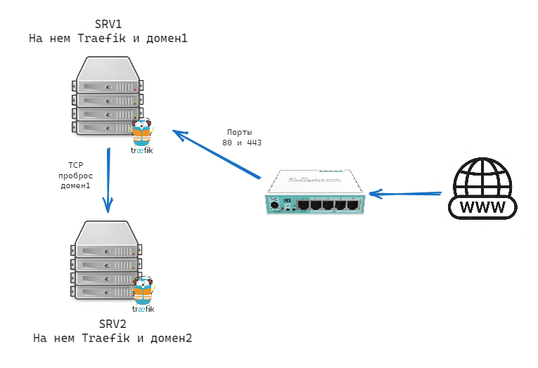

# TCP Routes

Начинав со скромной установки домашней лабы на базе самосборного ПК на 4 диска и хостинга на нем Plex, я за 5 лет начучился поднимать с запускать различные полезные вещи для дома.
Сейчас у меня есть несколько доменов с различным сервисами. Где то год назад я понял, что надо разделать сервисы по типу. Но была проблема - поскульку сервисы находятся на 3 и более разных хостах докера, то прописывать правила в Traefik нужно было на главном. Это было как бы норм, но не совсем удобно.
Поэтому я начал изучать, как можно было бы вынести конфиги и сам Траефик на разные хосты. И решение это TCP Route.

По сути, это TCP-маршрутизатор делающий следующее: если есть запросы, адресованные домен2 или его субдоменам, то запрос передается второму экземпляру Traefik, который прослушивает адрес 192.168.100.254:443 на другом моем хосте.



Для того, чтобы реализовать это, нужно создать файл yml в папке rules с определением route TCP:

```yml title="tcp-domain2.yml"
tcp:
  routers:
    tcp-domain2-rtr:
      entryPoints:
        - "https"
      rule: "HostSNIRegexp(`domain2.com`, `{subdomain:[a-z]+}.domain2.com`)"
      service: tcp-domain2-svc
      tls:
        passthrough: true
  services:
    tcp-domain2-svc:
      loadBalancer:
        servers:
          - address: "192.168.100.254:443"
```

Правда все равно есть большое НО:

!!! warning
    Если основной экземпляр Traefik не работает, то и TCP Route работать тоже не будет!