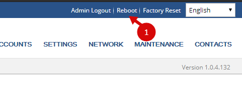

# Настройка телефонов через TFTP сервер

Опустим настройку самого TFTP сервера, в сети много есть информации по этому вопросу.

## Правка начального шаблона

Для начала, нам потребуется получить файл шаблона и немного его отредактировать.

Скачать можно c [облака](https://disk.yandex.ru/d/UJJK2Ttm1amJmg).

| **Параметры** | **Описание** |
| --- | --- |
| P47 | адрес сервера Астериск |
| P34 | пароль авторизации |
| P237 | сервер и папка, откуда берется конфиг |
| P30 | ntp сервер для синхронизации времени |
| P64 | часовой пояс |
| P2  | пароль на админку |
| P192 | сервер и папка, откуда берется обновление прошивки |

сохраняем файл.

## Заполнение файла с настройками

Чтобы не вводить номера телефонов в каждый файл, существует возможность по созданию файла с настройками.

Скачать файл можно [тут](https://disk.yandex.ru/d/S7XKjHypTigfyg). В файле заполняем:

| Параметр | Значение |
| --- | --- |
| `MAC` | MAC адрес |
| `User_ID_1` | номер |
| `Password_1` | пароль |
| `Auth_ID_1` | номер |
| `SIP_Name_1` | номер |

Файл сохраняем в формате `scv`, разделители **запятые**. Он нам потребуется дальше.

## Создание конфиг файлов

Для создания конфиг файлов используется программа [GSXmlGenerator_3.5](https://disk.yandex.ru/d/I3HvTLTLXHv4sA)

Запускаем программу, в ней:

| Параметр | Значение |
| --- | --- |
| Configuration Template | путь где находится шаблон |
| Output Path | путь до папки, куда будут сохраняться готовые файлы |
| Use CSV File | путь до файла csv с настройками |

После нажимаем на **Run with CSV as Input**

## Папка на tftp сервере

Создадим папку на tftp сервере, откуда телефон будет брать конфиг файл.

К примеру это будет папка `test`. Далее в папку следует закачать:

-   файл прошивки
-   3 файла звонков (не обязательно)
-   файлы конфигов

Файлы можно взять по [ссылке](https://disk.yandex.ru/d/4eji_swJJdshNQ)

В итоге получится такое содержание папки:

## Настройка на телефоне

Есть 2 способа настройки - ручной и автоматический

=== "Автоматический"

    Способ через конфигурирование DHCP и прописывание 66 опции.

    Открываем оснастку DHCP сервера и идем в параметры сервера. Далее ПКМ на центральной части - Настроить параметры:

    

    Ищем 066 параметр: 066 Имя узла сервера загрузки и прописываем путь до папки с конфигами:

    

    Нажимаем ОК.

    Теперь при включении телефона, телефон сам получит настройки подключения и сам обновит firmware

=== "Ручной"

    Включаем телефон и заходим на web-страницу администрирования:

    Стандартный логин/пароль - `admin`/`admin`

    Далее переходим на вкладку **Maintenance** и выбираем в выпадающем списке **Upgrade and Provisioning**:

    

    На открывшейся странице ищем раздел **Config**. Выбираем метод скачивание через tftp и указываем путь до нашего сервера.

    Внизу нажимаем **Save and Apply**.

    

    После сохранения вверху **Reboot**

    

    После перезагрузки, телефон сам скачает обновление с сервера.