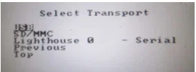

# Windows CE 5.0

Требуется скачать файлы: из [шары](https://disk.yandex.ru/d/YiTDTxSRqo1ddQ) по пути: `\2.Заливка ТСД\9090CE5\`

Далее устанавливаем на ПК программу [USBDownload](https://cloud.thest1tch.ru/s/gpeP3WbwqbWnKjG). Запускаем программу **USBDownload**, откроется окно:

Подключите кредл к компьютеру с помощью USB-кабеля. Переходим к ТСД.

1.  Вытаскиваем наполовину батарею
2.  Зажимаем одновременно курок и кнопку питания (красная)
3.  Вставляем батарею
4.  Отпускаем кнопку питания, удерживая при этом курок 
5.  Вставляем в кредл не отпуская курок
6.  После того как вставили отпускаем курок

Если на экране появилась меню, то вход в IPL произведён удачно:

Прошивка терминала производится в следующей последовательности (файлы лежат по пути : `\9090CE5\hex\`

=== "Для быстрой перезаливки"
    1.  Application (909Xc50BenAP032.hex)
    2.  Windows CE (909Xc50BenOS013000.hex)

=== "Для полной перезаливки"
    1.  Platform (909Xc50BenPL032.hex)
    2.  Partition table (909Xc50BenPT015.hex)
    3.  Application (909Xc50BenAP032.hex)
    4.  Windows CE (909Xc50BenOS013000.hex)
    5.  Monitor (909Xc50XenMO0152XX.hex)

На терминале выбираем строку с необходимым модулем (например **Application**), нажимаем энтер.

Выбираем USB – нажимаем энтер.

Выбираем USB standart – нажимаем энтер.

Выбираем Download – нажимаем энтер.

На экране видим ожидание загрузки файла.

На компьютере заходим в программу USB Download. Видим, что статус девайса -сonnected. Выбираем файл прошивки (начинаем прошивку с 909Xc50BenAP032.hex), затем жмём кнопку Load.

Начался процесс заливки в программе

По окончании заливки появится сообщение об успешной установке. Для возврата на экран из пункта 3 нажимаем энтер.

Для заливки второго файла, повторяем последние действия

После заливки последнего файла, выбираем **System Reset** терминал перезагрузится и предложит откалибровать экран. После успешной калибровки экрана загрузится рабочий стол.