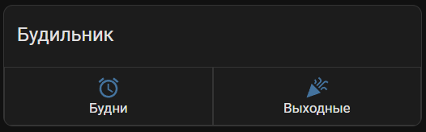
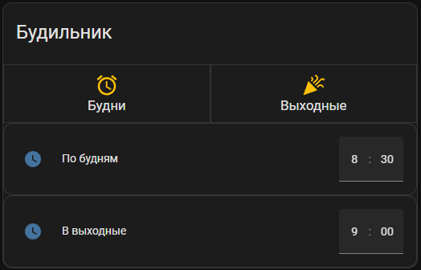

# Будильник для Home Assistant

Представление карточки в Home Assistant:

В карточке используется дополнительные компоненты. Ставятся при помощи HACS.:

- [custom:stack-in-card](https://github.com/custom-cards/stack-in-card)
- [custom:button-card](https://github.com/custom-cards/button-card)

## Карточка




??? example "Код карточки"

    ```yaml title="card-budilnik.yaml"
    type: custom:stack-in-card
    title: Будильник
    cards:
      - cards:
          - entity: input_boolean.alarm_weekday
            name: Будни
            size: 30px
            icon: mdi:alarm
            tap_action:
              action: toggle
            type: custom:button-card
          - entity: input_boolean.alarm_weekend
            name: Выходные
            icon: mdi:party-popper
            size: 30px
            tap_action:
              action: toggle
            type: custom:button-card
        type: horizontal-stack
      - type: conditional
        conditions:
          - entity: input_boolean.alarm_weekday
            state: 'on'
        card:
          type: entities
          entities:
            - entity: input_datetime.alarm_weekday
              name: По будням
      - type: conditional
        conditions:
          - entity: input_boolean.alarm_weekend
            state: 'on'
        card:
          type: entities
          entities:
            - entity: input_datetime.alarm_weekend
              name: В выходные
    ```

## Как это работает

В указанное время срабатывает будильник.

Начинает проигрываться мелодия.

Если солнце уже встало, открываются шторы. Иначе включается мягкий тусклый свет.

## Идеи на реализацию:

- [ ] Добавить возможность отложить пробуждение, используя куб Aqare
- [ ] Выключение будильника, используя куб Aqare

## Код будильника

??? example

    ```yaml
    #ДОБАВЛЯЕМ ЭЛЕМЕНТЫ ВВОД И УПРАВЛЕНИЯ 
    input_datetime:
      alarm_weekday:
        has_date: false
        has_time: true
      alarm_weekend:
        has_date: false
        has_time: true

    #ПЕРЕКЛЮЧАТЕЛИ
    input_boolean: 
      alarm_weekday:
      alarm_weekend:

    #СЕНСОРЫ ДЛЯ ПОДСЧЕТА ВРЕМЕНИ В ОТЛОЖЕННЫХ ФУНКЦИЯХ 
    sensor:
      - platform: template
        sensors:
          input_alarm_weekday:
            friendly_name: Будильник будни
            value_template: "{{ (((state_attr('input_datetime.alarm_weekday' , 'timestamp')) - (5 * 60))|timestamp_custom('%H:%M', false)) }}"
          
          input_alarm_weekend:
            friendly_name: Будильник выходные
            value_template: "{{ (((state_attr('input_datetime.alarm_weekend' , 'timestamp')) - (5 * 60))|timestamp_custom('%H:%M', false)) }}"

    binary_sensor:
      - platform: template
        sensors:
          alarm_weekday_start:
            friendly_name: Будильник будни
            value_template: "{{ states('sensor.time') == states('sensor.input_alarm_weekday_start') }}"
          alarm_weekend_start:
            friendly_name: Будильник выходные
            value_template: "{{ states('sensor.time') == states('sensor.input_alarm_weekend_start') }}"

    automation: 
      # ВКЛЮЧЕНИЕ БУДИЛЬНИКА ПРИ ЗАПУСКЕ HA 
      - id: 'startup_on_alarm_clock' 
        alias: Включение будильника при запуске HA 
        trigger: 
          platform: homeassistant 
          event: start 
        condition: 
          condition: time 
          after: '09:00:00' 
          before: '00:00:00' 
        action: 
          - delay: 0:01 

      # ВКЛЮЧЕНИЕ КЛАВИШАМИ. ПРОСТО ЗВУКОВОЕ СООБЩЕНИЕ О ВКЛЮЧЕНИИ 
      - id: 'on_alarm_clock' 
        alias: "Включение будильника клавишей" 
        trigger: 
          platform: state 
          entity_id: 
            - input_boolean.alarm_weekday 
            - input_boolean.alarm_weekend 
          to: 'on' 
        action: 
          - service: script.yandex_tts_alarm_on

      # ВЫКЛЮЧЕНИЕ КЛАВИШАМИ. ПРОСТО ЗВУКОВОЕ СООБЩЕНИЕ О ВЫКЛЮЧЕНИИ 
      - id: 'off_alarm_clock' 
        alias: "Выключение будильника клавишей" 
        trigger: 
          platform: state 
          entity_id: 
            - input_boolean.alarm_1_weekday 
            - input_boolean.alarm_1_weekend 
          to: 'off' 
        action: 
          - service: script.yandex_tts_alarm_off

      # Запуск будильника по будням
      - id: 'alarm_weekday' 
        alias: Wake me up (weekday) 
        trigger: 
          - platform: time_pattern 
            minutes: "/1" 
            seconds: 0 
        condition: 
          - condition: state 
            entity_id: input_boolean.alarm_weekday 
            state: 'on' 
          - condition: time 
            weekday: 
              - mon 
              - tue 
              - wed 
              - thu 
              - fri 
          - condition: template 
            value_template: >- 
              {{ now().strftime("%H:%M") == states.sensor.input_alarm_weekday.state }}
          - condition: state
            entity_id: person.thest1tch
            state: 'home'
        action: 
          - data: {} 
            service: script.wakeup_sequence 

      # Запуск будильника по выходным
      - id: 'alarm_weekend' 
        alias: Wake me up (weekend) 
        trigger: 
          - platform: time_pattern 
            minutes: "/1" 
            seconds: 0 
        condition: 
          - condition: state 
            entity_id: input_boolean.alarm_weekend 
            state: 'on' 
          - condition: time 
            weekday: 
              - sat 
              - sun 
          - condition: template 
            value_template: >- 
              {{ now().strftime("%H:%M") == states.sensor.input_alarm_weekend.state }} 
          - condition: state
            entity_id: person.thest1tch
            state: 'home'
        action: 
          - data: {} 
            service: script.wakeup_sequence

    script: 
      # Включение люстры, если солнце еще не встало
      wakeup_celib_start: 
        alias: wakeup_celib_start
        sequence: 
          - condition: state
            entity_id: sun.sun
            state: below_horizon
            for:
              hours: 0
              minutes: 1
              seconds: 0
          - service: light.turn_on 
            data: 
              brightness: '3' 
              brightness_step: 2
              entity_id: 
                - light.yeelight_ceilb_0x17879e8e_nightlight

      # Открывание штор, если солнце уже встало
      wakeup_cover_start:
        alias: wakeup_cover_start
        sequence:
          - condition: state
            entity_id: sun.sun
            state: above_horizon
          - service: cover.set_cover_position
            data: 
              position: 10
            target:
              entity_id: cover.yeelink_ctmt1_c8c9_curtain
          - delay: 00:02:00
          - service: cover.set_cover_position
            data: 
              position: 30
            target:
              entity_id: cover.yeelink_ctmt1_c8c9_curtain
          - delay: 00:02:00
          - service: cover.set_cover_position
            data: 
              position: 50
            target:
              entity_id: cover.yeelink_ctmt1_c8c9_curtain
          - delay: 00:02:00
          - service: cover.set_cover_position
            data: 
              position: 70
            target:
              entity_id: cover.yeelink_ctmt1_c8c9_curtain
          - delay: 00:02:00
          - service: cover.set_cover_position
            data: 
              position: 100
            target:
              entity_id: cover.yeelink_ctmt1_c8c9_curtain

      # Главный скрипт будильника 
      wakeup_sequence: 
        alias: wakeup_sequence 
        sequence: 
          - service: script.turn_on
            target:
              entity_id: script.wakeup_celib_start
          - delay: 00:00:05
          - service: script.turn_on
            target:
              entity_id: script.wakeup_cover_start
          - delay: 00:00:05
          - service: script.turn_on
            target:
              entity_id: script.yandex_tts_alarm_start

      # TTS YANDEX
      yandex_tts_alarm_start:
        alias: "YaStation Запуск будильника"
        sequence:
        - service: media_player.volume_set
          data:
            entity_id:
            - media_player.yandex_station_m0017y300grsqb
            volume_level: 0.1
        - delay: 00:00:01
        - service: yandex_station.send_command
          data:
            entity_id: media_player.yandex_station_m0017y300grsqb
            command: sendText
            text: Включи фоновую музыку
        - delay: 00:01:00
        - service: media_player.volume_set
          data:
            entity_id:
            - media_player.yandex_station_m0017y300grsqb
            volume_level: 0.2
        - delay: 00:00:30
        - service: media_player.volume_set
          data:
            entity_id:
            - media_player.yandex_station_m0017y300grsqb
            volume_level: 0.3
        - delay: 00:00:30
        - service: media_player.volume_set
          data:
            entity_id:
            - media_player.yandex_station_m0017y300grsqb
            volume_level: 0.4

      yandex_tts_alarm_on:
        alias: "YaStation Включение будильника"
        sequence:
        - service: media_player.volume_set
          data:
            entity_id:
            - media_player.yandex_station_m0017y300grsqb
            volume_level: 0.4
        - delay: 00:00:01
        - service: media_player.play_media
          entity_id: media_player.yandex_station_m0017y300grsqb
          data:
            media_content_id: Включаю будильник.
            media_content_type: text

      yandex_tts_alarm_off:
        alias: YaStation_Выключение будильника
        sequence:
        - service: media_player.volume_set
          data:
            entity_id:
            - media_player.yandex_station
            volume_level: 0.4
        - service: media_player.play_media
          entity_id: media_player.yandex_station_m0017y300grsqb
          data:
            media_content_id: Будильник выключен.
            media_content_type: text
    ```