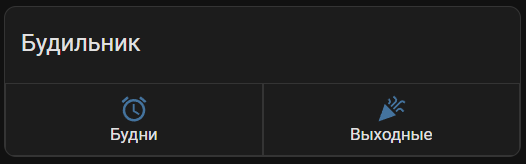
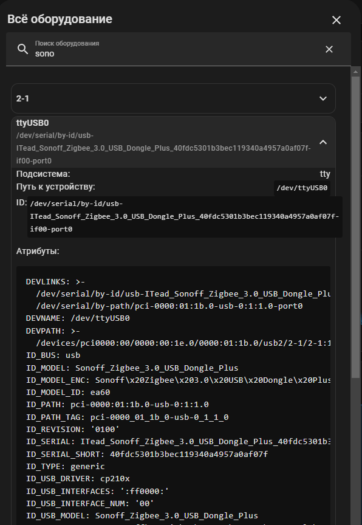

# Zigbee2mqtt - установка и обновление в Home Assistant

Чтоб установить актуальную версию, нам нужно зайти в магазин дополнений и добавить туда новую ссылку: `https://github.com/zigbee2mqtt/hassio-zigbee2mqtt`



После добавления этой ссылки в репозитории, необходимо перезапустить Home Assistant.

После перезапуска, у нас появится новый аддон zigbee2mqtt, который можно установить. Перед установкой старый можно не удалять, достаточно его выключить.

!!! warning

    Если есть какие-то аддоны или надстройки, что используют стик Zigbee, их надо удалять. 
    Именно удалить, а не отключить.
    Иначе работать Zigbee2mqtt не будет.


## Sonoff ZB Dongle-E - USB стик

[Sonoff zb dongle-E](http://alii.pub/6hb9ju)

USB Stick Sonoff ZB Dongle-E – это новый координатор Zigbee от компании SOnoff. С недавних пор они начали делать координаторы для Home Assistant и версия “E” это уже вторая версия данного свистка.

Данный Zigbee-стик у меня не заработал сам. Пришлось дописывать в конфигурации аддона Zigbee2mqtt.

На момент подключения этого стика у меня стояла версия zigbee2mqtt аддона 1.33.1-1

Для настройки нужно узнать адрес стика sonoff zb dongle-E:

1. Для этого вставим его в USB порт
2. Перейдем в **Настройки**
3. Далее в **Система**
4. Выбираем **Оборудование**
5. Нажимает на **3 точки** в правом верхнем углу экрана
6. Выбираем **Все оборудование**. 
7. Находим через поиск наш стик - можно ввести в поиск sonoff, покажется адрес



Копируем строчу начиная от **DEVLINKS:**. Строчка должна выглядеть примерно так:

```
/dev/serial/by-id/usb-ITead_Sonoff_Zigbee_3.0_USB_Dongle_Plus_40fdc5301b3bec119340a4957a0af07f-if00-port0
```

Далее заходим непосредственно в аддон. Настройки->Дополнения->Zigbee2mqtt  

Далее в самом аддоне Zigbee2mqtt переходим во вкладку "Конфигурация".

Там в блоке Serial прописываем следующее:

```
port: >-
  /dev/serial/by-id/usb-ITead_Sonoff_Zigbee_3.0_USB_Dongle_Plus_40fdc5301b3bec119340a4957a0af07f-if00-port0
# adapter: ezsp # должно работать и без этого. Если нет - раскоментить
```      

После этого запускаем аддон и все должно начать работать.