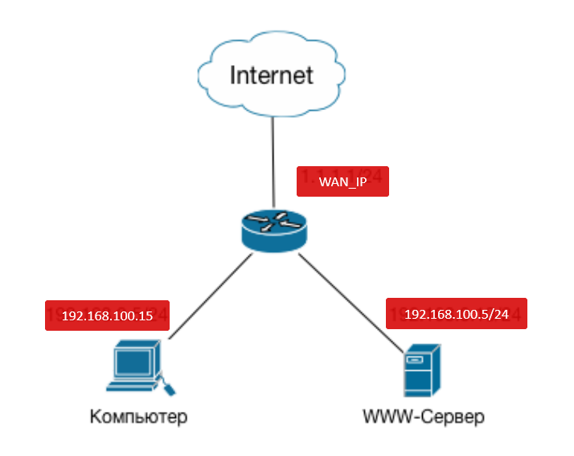
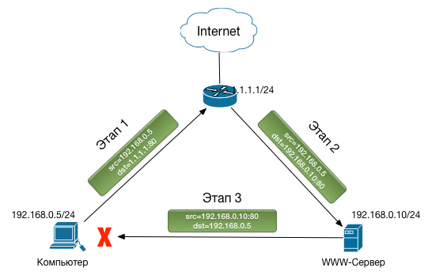
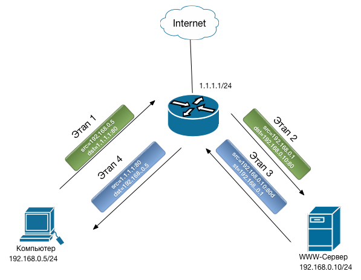

# Hairpin Nat

Допустим нужно прокинуть 80 и 443 порт

`192.168.100.0/24` - наша подсеть
`WAN_IP` - внешний IP-адрес
`192.168.100.5` - сервер, куда делаем проброс
```
/ip firewall nat
add action=dst-nat chain=dstnat dst-address=WAN_IP dst-port=80 protocol=tcp to-addresses=192.168.100.5
add action=masquerade chain=srcnat dst-address=192.168.100.5 dst-port=80 protocol=tcp src-address=192.168.100.0/24
add action=dst-nat chain=dstnat dst-address=WAN_IP dst-port=443 protocol=tcp to-addresses=192.168.100.5
add action=masquerade chain=srcnat dst-address=192.168.100.5 dst-port=443 protocol=tcp src-address=192.168.100.0/24
```

## Подробности
Конфигурация нашей сети:

- Вы имеете IP адрес `WAN_IP` на интерфейсе WAN вашего маршрутизатора
- Вы имеете IP адрес `192.168.100.1/24` на интерфейсе LAN вашего маршрутизатора.
- Вы имеете www-сервер с адресом `192.168.100.5` в LAN сегменте.
- Адрес вашего компьютера находится в диапазоне адресов LAN. Для примера пусть это будет `192.168.100.15`



Чтобы опубликовать web-сервер на внешнем ресурсе, создается правило dst-nat:

```
/ip firewall nat add action=dst-nat chain=dstnat dst-address=WAN_IP dst-port=80 protocol=tcp to-addresses=192.168.100.5
```
**in-interface** не указан потому, что правило должно срабатывать при обращении на порт 80 адреса `WAN_IP` с любого интерфейса

Вы это делаете и.. И у вас все замечательно работает снаружи сети (при обращении из Интернет), но обращение с вашего компьютера по адресу http://WAN_IP говорит «Нет ответа от сервера». Для того, чтобы понять, что же происходит, рисуем схему прохождения и преобразования пакета:


Теперь распишем что происходит на каждом этапе.
1. Компьютер с адреса `192.168.100.15` пытается установить соединение с адресом `WAN_IP` по `80 порту` и отправляет пакет на маршрутизатор.
1. На маршрутизаторе срабатывает правило `dst-nat`, в результате чего адрес назначения пакета меняется на `192.168.100.5`, и пакет отправляется на www-сервер `192.168.100.5`.
1. Узел `192.168.100.5` получив пакет с адресом источника `192.168.100.15`, определяет, что они оба находятся в одной локальной сети и отвечает ему напрямую, минуя маршрутизатор.

**Проблема**
Компьютер, отправив пакет на адрес WAN_IP, вдруг получает ответ с адреса 192.168.100.5. Естественно этот пакет он игнорирует и соединение не устанавливается.

**Решение**
Чтобы решить эту проблему, необходимо, чтобы www-сервер получил пакет у которого адрес источника будет равен адресу маршрутизатора. Добавляем к нашей конфигурации правило, которое заменит адрес отправителя, адресом интерфейса маршрутизатора и получаем следующую конфигурацию:

```
/ip firewall nat
add action=dst-nat chain=dstnat dst-address=1.1.1.1 dst-port=80 protocol=tcp to-addresses=192.168.0.10
add action=masquerade chain=srcnat dst-address=192.168.0.10 dst-port=80 protocol=tcp src-address=192.168.0.0/24
```
Теперь у нас из конфигурация работает правильно. Схема для понимания:


**Работа схемы**
1. Компьютер с адреса `192.168.100.15` пытается установить соединение с адресом WAN_IP по 80 порту и отправляет пакет на маршрутизатор.
1. На маршрутизаторе срабатывает правило `dst-nat`, в результате чего адрес назначения пакета меняется на `192.168.100.5` и правило `src-nat`, где адрес источника пакета меняется на адрес интерфейса маршрутизатора (`192.168.100.1`). После чего пакет отправляется на www-сервер `192.168.100.5`.
1. Узел `192.168.100.5` получив пакет с адресом источника `192.168.100.1` (адрес маршрутизатора), определяет, что они оба находятся в одной локальной сети и отвечает ему. В результате чего пакет попадает на маршрутизатор
1. Connection Tracker маршрутизатора получив такой пакет выполняет обратное преобразование адресов. Компьютер получает ожидаемый ответ с адреса `WAN_IP`

Вот такая схема трансляции адресов и является Hairpin NAT.

Нужно отметить что у схемы есть недостаток. Заключается он в том, что публикуемый сервер будет получать запросы от хостов локальной сети с адреса маршрутизатора. Что не всегда хорошо. Например, если Вы так опубликуете прозрачный proxy-сервер, вряд ли у вас получится собрать нормальную статистику.

Альтернативой такой схемы могут служить.

Вынос публикуемых, или вообще всех серверов в отдельную подсеть.
Использование так называемого **split-dns**. Когда компьютер находясь снаружи сети на запрос www.mydomain.com получит адрес `WAN_IP`, а находясь внутри сети на этот же запрос получит адрес `192.168.100.5`.

---
[Использованы материалы сайта](https://housecomputer.ru/devices/switch/mikrotik/Setting_up_NAT_-_hairpin/Setting_up_NAT_-_hairpin.html){ .md-button .md-button--primary }

