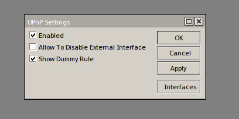
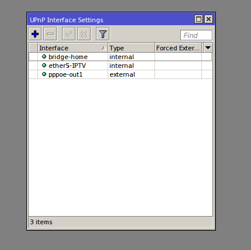

# UPnP

Именно эта штука и отвечает за то, что нужные порты будут открываться автоматически по запросу программы. Настройка достаточно простая и заключается всего нескольких нажатиях мышки.  
  
Подключаемся к нашему Mikrotik через Winbox и открываем необходимый раздел:  
  
**IP->UPnP**



Здесь достаточно поставить галочку Enable, но после этого все-равно ничего работать не будет. А все потому, что надо микротику сказать, что есть внешний интерфейс, а что внутренний. Для этого, в открытом ранее окошке находим кнопку **Interfaces** и нажимаем ее.

Сейчас у нас ничего нет и окно пустое. Жмем синий плюсик и добавляем два интерфейса.



**External**

 — это наш внешний интерфейс. У меня это pppoe-соединение с провайдером. У вас может быть так же, а если получаете по DHCP, то выбрать надо тот, где висит DHCP-клиент.

**Internal**

 — это наш внутренний интерфейс. У меня часть портов объединена в bridge, поэтому я выбираю интерфейс bridge-home. Вы же выбираете свой.

Теперь закрываем окошко настройки интерфейсов. Затем жмем Apply и Ok. Вот и все. После проделанных манипуляций порты на микротике будут открываться автоматически без вмешательства в его настройку.

То же самое можно сделать не только в графической оболочке, но и через терминал.

```plaintext
/ip upnp set enabled=yes show-dummy-rule=yes allow-disable-external-interface=no
/ip upnp interfaces add interface=pppoe-out1 type=external add interface=bridge-home type=internal
```

Проверить работает или нет довольно просто, для этого достаточно зайти в раздел IP->Firewall->NAT и посмотреть наличие новых правил с префиксом D. Если такие есть, значит все в порядке.