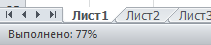
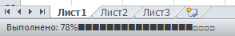

# Прогресс бар VBA

> Использование APPLICATION.STATUSBAR

## Прогресс бар внизу страницы:
```vba
Application.StatusBar = "TEST"
	DoEvents
	...
Application.StatusBar = False
```

## Прогресс бар для циклов:
```vba
For i = 1 To n
        Istochnik = Cells(i, 20)
        Application.StatusBar = "Делаю источник " & i & "-" & Istochnik & "/" & 50 & ""
        DoEvents
Next
```
## Можно сделать показ % завершения:



```vba
Sub ShowProgressBar()
    Dim lAllCnt As Long, lr as Long
    Dim rc As Range
    'кол-во ячеек в выделенной области
    lAllCnt = Selection.Count
    'цикл по всем ячейкам в выделенной области
    For Each rc In Selection
        'прибавляем 1 при каждом шаге
        lr = lr + 1
        Application.StatusBar = "Выполнено: " & Int(100 * lr / lAllCnt) & "%"
        DoEvents 'чтобы форма перерисовывалась
    Next
    'сбрасываем значение статусной строки
    Application.StatusBar = False
End Sub
```
## Текст + блоки символов из 10 штук:


```vba
Sub StatusBar2()
    Dim lr As Long, lp As Double
    Dim lAllCnt As Long 'кол-во итераций
    Dim s As String
    lAllCnt = 10000
    For lr = 1 To lAllCnt
        lp = lr \ 100 'десятая часть всего массива
        'формируем строку символов(от 1 до 10)
        s = String(lp \ 10, ChrW(10152)) & String(11 - lp \ 10, ChrW(8700))
        Application.StatusBar = "Выполнено: " & lp & "% " & s: DoEvents
        DoEvents
    Next
    'очищаем статус-бар от значений после выполнения
    Application.StatusBar = False
End Sub
```

## Текст + блоки квадратов из n штук:

количество квадратов можно менять


```vba
Sub StatusBar3()
    Dim lr As Long
    Dim lAllCnt As Long 'кол-во итераций
    Const lMaxQuad As Long = 20 'сколько квадратов выводить
    lAllCnt = 10000
  
    For lr = 1 To lAllCnt
        Application.StatusBar = "Выполнено: " & Int(100 * lr / lAllCnt) & "%" & String(CLng(lMaxQuad * lr / lAllCnt), ChrW(9632)) & String(lMaxQuad - CLng(lMaxQuad * lr / lAllCnt), ChrW(9633))
        DoEvents
    Next
    'очищаем статус-бар от значений после выполнения
    Application.StatusBar = False
End Sub
```