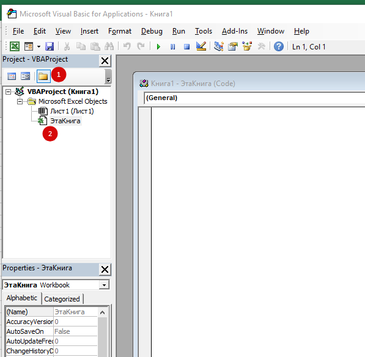

## Защита страницы через VBA

Каждый кто хоть раз писал макросы, сталкивался с тем, что требуется защитить лист и формулы на нем от шаловливых ручек пользователей. При том, нужно чтобы макросы на листе работали. Самое просто решение, это перед кодом макроса, добавить это:

```vba
Worksheets("Лист1").Unprotect Password:="123"
'тут макрос делает действия
Worksheets("Лист1").Protect Password:="123"
```

Это будет работать, но у такого подхода есть и свои минусы. Во-первых, нужно эту конструкцию размещать в каждом макросе. Во-вторых - если будет ошибка, лист останется без защиты.

### Есть другой способ

Нажмите `Alt+F11`, чтобы попасть в редактор Visual Basic. Затем в левом верхнем углу в окне Project Explorer (если его не видно, то нажмите Ctrl+R) модуль ЭтаКнига (ThisWorkbook) и откройте двойным щелчком:

{ loading=lazy }


Вставьте этот код:

```vba
Private Sub Workbook_Open()
   'включаем защиту первого листа для пользователя, но не макроса
   Worksheets("Лист1").Protect Password:="123", UserInterfaceOnly:=True     

   'второй лист защищаем аналогично, но с возможностью пользоваться группировкой
   Worksheets("Лист2").EnableOutlining = True
   Worksheets("Лист2").Protect Password:="555", UserInterfaceOnly:=True
End Sub
```

Данный код будет автоматически запускаться при открытии файла и ставить защиту на заданные листы. Параметр `UserInterfaceOnly` указывает Excel, что защита не должна работать для действий макроса, а только на операции юзера. 
Второй параметр `EnableOutlining` разрешает пользоваться группировкой.

## Исправление примечаний VBA

Бывает так, что ты вставляешь примечания и они уползают вниз при действиях со строками. 

Чтобы такого не было, используй этот макрос:

```vba
Sub align_comments()
Dim x As Comment
For Each x In ActiveSheet.Comments
   x.Shape.Left = x.Parent.Offset(0, 1).Left + 10
   x.Shape.Top = x.Parent.Top
Next
End Sub
```

## Открытие файла VBA

Для открытия 1 файла и передачи его на дальнейшую обработку, используй этот код:

```vba
avFiles = Application.GetOpenFilename _
      ("Excel files(*.xls*),*.xls*", 1, "Выбери Excel файл", , False)
If VarType(avFiles) = vbBoolean Then
      'была нажата кнопка отмены - выход из процедуры
      Exit Sub
End If
 
Set avFiles1 = Workbooks.Open(Filename:=avFiles)
```

Чтобы открыть много файлов и запустить обработку по ним, используем цикл:

```vba
FilesToOpen = Application.GetOpenFilename _
      (FileFilter:="All files (*.*), *.*", _
      MultiSelect:=True, Title:="Files to Merge")
 
If TypeName(FilesToOpen) = "Boolean" Then
      MsgBox "Не выбрано ни одного файла!"
      Exit Sub
End If
 
'проходим по всем выбранным файлам
x = 1
While x <= UBound(FilesToOpen)
    With Workbooks.Open(FilesToOpen(x)).Sheets(1)
        ...
        ...
    End With
     x = x + 1
Wend
```

## Отправка почты VBA

отправляет почту, используя для этого запущенный MS Outlook

```vba
' Запрос ввода темы письма
    Dim vRetVal
        vRetVal = InputBox("Введи тему письма", "Тема", "Test")
    ActiveSheet.Range("I3").Value = vRetVal
 
        Dim OutApp As Object
        Dim OutMail As Object
        Dim cell As Range
         
        Send_ist = Cells(1, 1)
          
        Application.ScreenUpdating = False
        Set OutApp = CreateObject("Outlook.Application")
        OutApp.Session.Logon
        Set OutMail = OutApp.CreateItem(0)
        On Error Resume Next
        With OutMail
            .To = Send_ist
            .Body = "Заполнить в день получения и отправить обратно на your_email"
            .Subject = Range("A1").Value
            .Attachments.Add iFullName
            .Send
        End With
 
        On Error GoTo 0
        Set OutMail = Nothing
```

## Отключение обновления экрана
```vba
Application.ScreenUpdating = False
' в конце
Application.ScreenUpdating = True
```

## Прогресс бар VBA

> Использование APPLICATION.STATUSBAR
{.is-info}

### Прогресс бар внизу страницы:
```vba
Application.StatusBar = "TEST"
	DoEvents
	...
Application.StatusBar = False
```

### Прогресс бар для циклов:
```vba
For i = 1 To n
        Istochnik = Cells(i, 20)
        Application.StatusBar = "Делаю источник " & i & "-" & Istochnik & "/" & 50 & ""
        DoEvents
Next
```
### Можно сделать показ % завершения:


```vba
Sub ShowProgressBar()
    Dim lAllCnt As Long, lr as Long
    Dim rc As Range
    'кол-во ячеек в выделенной области
    lAllCnt = Selection.Count
    'цикл по всем ячейкам в выделенной области
    For Each rc In Selection
        'прибавляем 1 при каждом шаге
        lr = lr + 1
        Application.StatusBar = "Выполнено: " & Int(100 * lr / lAllCnt) & "%"
        DoEvents 'чтобы форма перерисовывалась
    Next
    'сбрасываем значение статусной строки
    Application.StatusBar = False
End Sub
```
### Текст + блоки символов из 10 штук:


```vba
Sub StatusBar2()
    Dim lr As Long, lp As Double
    Dim lAllCnt As Long 'кол-во итераций
    Dim s As String
    lAllCnt = 10000
    For lr = 1 To lAllCnt
        lp = lr \ 100 'десятая часть всего массива
        'формируем строку символов(от 1 до 10)
        s = String(lp \ 10, ChrW(10152)) & String(11 - lp \ 10, ChrW(8700))
        Application.StatusBar = "Выполнено: " & lp & "% " & s: DoEvents
        DoEvents
    Next
    'очищаем статус-бар от значений после выполнения
    Application.StatusBar = False
End Sub
```

### Текст + блоки квадратов из n штук:

количество квадратов можно менять


```vba
Sub StatusBar3()
    Dim lr As Long
    Dim lAllCnt As Long 'кол-во итераций
    Const lMaxQuad As Long = 20 'сколько квадратов выводить
    lAllCnt = 10000
  
    For lr = 1 To lAllCnt
        Application.StatusBar = "Выполнено: " & Int(100 * lr / lAllCnt) & "%" & String(CLng(lMaxQuad * lr / lAllCnt), ChrW(9632)) & String(lMaxQuad - CLng(lMaxQuad * lr / lAllCnt), ChrW(9633))
        DoEvents
    Next
    'очищаем статус-бар от значений после выполнения
    Application.StatusBar = False
End Sub
```

## Создание файла VBA

Простое

```vba
iFullName = ThisWorkbook.Path & "name.xlsx"
```
С именем из ячейки:

```vba
iFullName = ThisWorkbook.Path & "\" & Range("A1").Value & ".xlsx"
```

## Список уникальных значений VBA

```vba
PS = Range("A" & Rows.Count).End(xlUp).Row
Range("N6:N" & PS).AdvancedFilter Action:=xlFilterCopy, CopyToRange:=Range("T11"), Unique:=True
Range("T11:T300").Font.ColorIndex = 5
MsgBox "Создали уникальный список источников"
```

## Удаление пароля VBA

> Пожалуйста, сделайте резервную копию ваших файлов в первую очередь!
{.is-warning}

### Для 32 битной версии
Откройте файл(ы), которые содержат ваши заблокированные проекты VBA
Создайте новый файл **xlsm** и сохраните этот код в `Module1`

```vba
code credited to Siwtom (nick name), a Vietnamese developer

Option Explicit

Private Const PAGE_EXECUTE_READWRITE = &H40

Private Declare Sub MoveMemory Lib "kernel32" Alias "RtlMoveMemory" _
        (Destination As Long, Source As Long, ByVal Length As Long)

Private Declare Function VirtualProtect Lib "kernel32" (lpAddress As Long, _
        ByVal dwSize As Long, ByVal flNewProtect As Long, lpflOldProtect As Long) As Long

Private Declare Function GetModuleHandleA Lib "kernel32" (ByVal lpModuleName As String) As Long

Private Declare Function GetProcAddress Lib "kernel32" (ByVal hModule As Long, _
        ByVal lpProcName As String) As Long

Private Declare Function DialogBoxParam Lib "user32" Alias "DialogBoxParamA" (ByVal hInstance As Long, _
        ByVal pTemplateName As Long, ByVal hWndParent As Long, _
        ByVal lpDialogFunc As Long, ByVal dwInitParam As Long) As Integer

Dim HookBytes(0 To 5) As Byte
Dim OriginBytes(0 To 5) As Byte
Dim pFunc As Long
Dim Flag As Boolean

Private Function GetPtr(ByVal Value As Long) As Long
    GetPtr = Value
End Function

Public Sub RecoverBytes()
    If Flag Then MoveMemory ByVal pFunc, ByVal VarPtr(OriginBytes(0)), 6
End Sub

Public Function Hook() As Boolean
    Dim TmpBytes(0 To 5) As Byte
    Dim p As Long
    Dim OriginProtect As Long

    Hook = False

    pFunc = GetProcAddress(GetModuleHandleA("user32.dll"), "DialogBoxParamA")


    If VirtualProtect(ByVal pFunc, 6, PAGE_EXECUTE_READWRITE, OriginProtect) <> 0 Then

        MoveMemory ByVal VarPtr(TmpBytes(0)), ByVal pFunc, 6
        If TmpBytes(0) <> &H68 Then

            MoveMemory ByVal VarPtr(OriginBytes(0)), ByVal pFunc, 6

            p = GetPtr(AddressOf MyDialogBoxParam)

            HookBytes(0) = &H68
            MoveMemory ByVal VarPtr(HookBytes(1)), ByVal VarPtr(p), 4
            HookBytes(5) = &HC3

            MoveMemory ByVal pFunc, ByVal VarPtr(HookBytes(0)), 6
            Flag = True
            Hook = True
        End If
    End If
End Function

Private Function MyDialogBoxParam(ByVal hInstance As Long, _
        ByVal pTemplateName As Long, ByVal hWndParent As Long, _
        ByVal lpDialogFunc As Long, ByVal dwInitParam As Long) As Integer
    If pTemplateName = 4070 Then
        MyDialogBoxParam = 1
    Else
        RecoverBytes
        MyDialogBoxParam = DialogBoxParam(hInstance, pTemplateName, _
                           hWndParent, lpDialogFunc, dwInitParam)
        Hook
    End If
End Function
```
Вставьте этот код под вышеуказанным кодом в Module1 и запустите его
```vba
Sub unprotected()
    If Hook Then
        MsgBox "VBA Project is unprotected!", vbInformation, "*****"
    End If
End Sub
```
Возвращайтесь к своим проектам VBA и наслаждайтесь.

### Для 64 битной версии:
Откройте файл (ы), содержащий ваши заблокированные проекты VBA.

Создайте новый файл xlsm и сохраните этот код в `Module1`
```vba
Option Explicit

Private Const PAGE_EXECUTE_READWRITE = &H40

Private Declare PtrSafe Sub MoveMemory Lib "kernel32" Alias "RtlMoveMemory" _
(Destination As LongPtr, Source As LongPtr, ByVal Length As LongPtr)

Private Declare PtrSafe Function VirtualProtect Lib "kernel32" (lpAddress As LongPtr, _
ByVal dwSize As LongPtr, ByVal flNewProtect As LongPtr, lpflOldProtect As LongPtr) As LongPtr

Private Declare PtrSafe Function GetModuleHandleA Lib "kernel32" (ByVal lpModuleName As String) As LongPtr

Private Declare PtrSafe Function GetProcAddress Lib "kernel32" (ByVal hModule As LongPtr, _
ByVal lpProcName As String) As LongPtr

Private Declare PtrSafe Function DialogBoxParam Lib "user32" Alias "DialogBoxParamA" (ByVal hInstance As LongPtr, _
ByVal pTemplateName As LongPtr, ByVal hWndParent As LongPtr, _
ByVal lpDialogFunc As LongPtr, ByVal dwInitParam As LongPtr) As Integer

Dim HookBytes(0 To 5) As Byte
Dim OriginBytes(0 To 5) As Byte
Dim pFunc As LongPtr
Dim Flag As Boolean

Private Function GetPtr(ByVal Value As LongPtr) As LongPtr
    GetPtr = Value
End Function

Public Sub RecoverBytes()
    If Flag Then MoveMemory ByVal pFunc, ByVal VarPtr(OriginBytes(0)), 6
End Sub

Public Function Hook() As Boolean
    Dim TmpBytes(0 To 5) As Byte
    Dim p As LongPtr
    Dim OriginProtect As LongPtr

    Hook = False

    pFunc = GetProcAddress(GetModuleHandleA("user32.dll"), "DialogBoxParamA")


    If VirtualProtect(ByVal pFunc, 6, PAGE_EXECUTE_READWRITE, OriginProtect) <> 0 Then

        MoveMemory ByVal VarPtr(TmpBytes(0)), ByVal pFunc, 6
        If TmpBytes(0) <> &H68 Then

            MoveMemory ByVal VarPtr(OriginBytes(0)), ByVal pFunc, 6

            p = GetPtr(AddressOf MyDialogBoxParam)

            HookBytes(0) = &H68
            MoveMemory ByVal VarPtr(HookBytes(1)), ByVal VarPtr(p), 4
            HookBytes(5) = &HC3

            MoveMemory ByVal pFunc, ByVal VarPtr(HookBytes(0)), 6
            Flag = True
            Hook = True
        End If
    End If
End Function

Private Function MyDialogBoxParam(ByVal hInstance As LongPtr, _
ByVal pTemplateName As LongPtr, ByVal hWndParent As LongPtr, _
ByVal lpDialogFunc As LongPtr, ByVal dwInitParam As LongPtr) As Integer

    If pTemplateName = 4070 Then
        MyDialogBoxParam = 1
    Else
        RecoverBytes
        MyDialogBoxParam = DialogBoxParam(hInstance, pTemplateName, _
                   hWndParent, lpDialogFunc, dwInitParam)
        Hook
    End If
End Function
```
Вставьте этот код в Module2 и запустите его
```vba
Sub unprotected()
    If Hook Then
        MsgBox "VBA Project is unprotected!", vbInformation, "*****"
    End If
End Sub
```