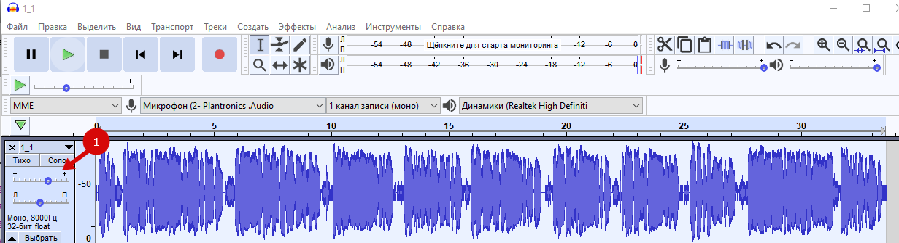
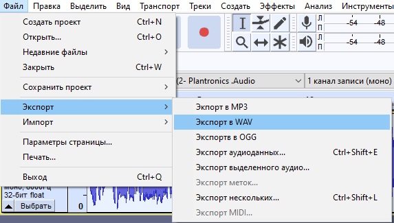
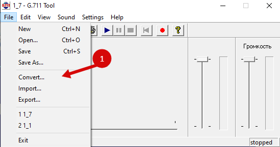
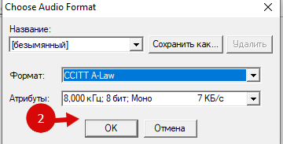
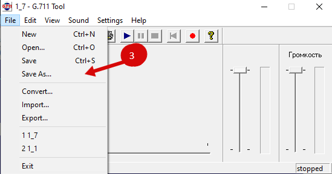
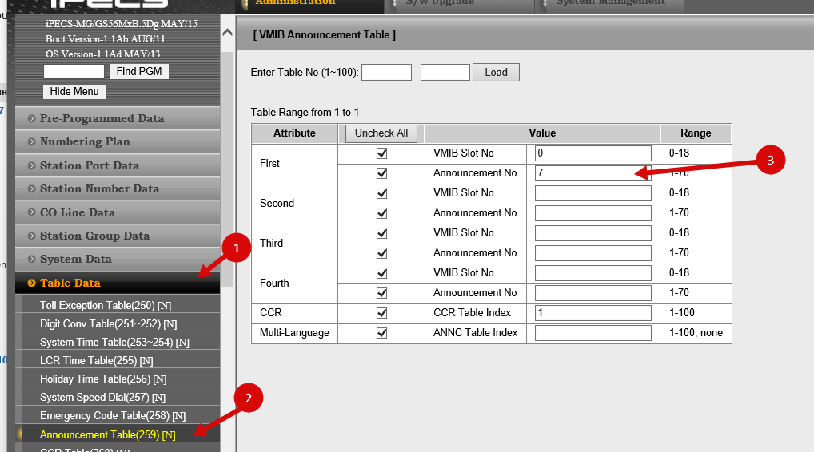

Иногда требуется сделать так, чтобы текущее голосовое приветствие было погромче, или нужно его изменить. Чтобы это сделать, открываем веб консоль станции, идем в `S/W Upgrade` ⇒ `AAFU Upload/Download`

Там выбираем `Individual SysGreeting Download` - это список всех голосовых приветсвий и сообщений, записанных в память АТС.

Далее 2 варинта:

1.  Создать свое
2.  Отредактировать текущее

## Отредактировать текущее

Скачиваем программу [Audacity](https://www.audacityteam.org/download/) , открываем файл, скачанный с АТС и ползунком делаем громче. Тут же можно и проверить:

далее сохраняем:

В окне сохранения ничего не меняем и сохраняем.

Теперь нужно конвертировать в формат АТС - `G.711 A-law wave`

[Скачиваем ПО](https://cloud.st1t.ru/s/dm5gYGP6f57t8Ex). В нем открываем наш файл. Далее:

Готовый файл загружаем на АТС, выбирая `Individual SysGreeting Upload`

Чтобы применить измененное приветствие, идем в `GM259`, вводим номер таблицы (1) и в поле `Announcement No` ставим номер загруженного файла. Нажимаем сохранить и проверяем:

