## Требования
-   Бекапим все, что раньше было на жестких дисках, так как в процессе установки все будет стерто и отформатировано.
-   USB флешка что будет выступать в роли загрузчика, должна быть более 2 Гб
-   Монитор и клава с мышкой для отладки возможных проблем
-   Сам Microserver должен быть в той же сети, что и ПК с которого проводим настройку

## Загрузочная флешка

Начальная стадия установки DSM, это создание загрузочной флешки. Путем тестов, нашел стабильную версию загрузчика - **v1.02b**, под **ds3615**

Версии собраны тут: https://mega.nz/folder/yQpw0YTI#DQqIzUCG2RbBtQ6YieScWg/folder/iJZjAJoa

Скачав нужный загрузчик, нужно его отредактировать под себя и записать на флешку.

Нам потребуется любая флешка от 2 Гб и установленные программы:

1.  OSFMount - небольшая бесплатная утилита, которая позволяет монтировать ранее сделанные образы дисков и представлять их в виде виртуальных приводов. Необходима для монтирования и последующей редакции образа загрузчика.  
    [https://www.osforensics.com/tools/mount-disk-images.html](https://www.osforensics.com/tools/mount-disk-images.html)
2.  Notepad++ - свободный текстовый редактор с открытым исходным кодом для Windows. Необходима для редактирования **grub.cfg**  
    [https://notepad-plus-plus.org/](https://notepad-plus-plus.org/)
3.  Rufus - это утилита, которая помогает форматировать и создавать загрузочные Flash. Необходима для записи загрузчика.  
    [https://rufus.ie/](https://rufus.ie/)

Данные программы, кроме OSFMount, могут быть и другими, в зависимости от вашего предпочтения.

Открываем скачанный необходимый загрузчик в программе OSFMount, монтируем образ.

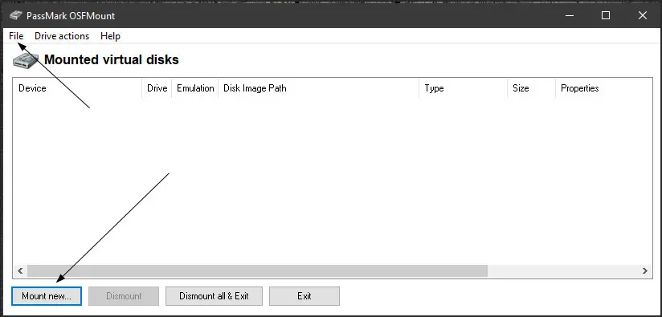

Открываем ранее скачанный образ загрузчика

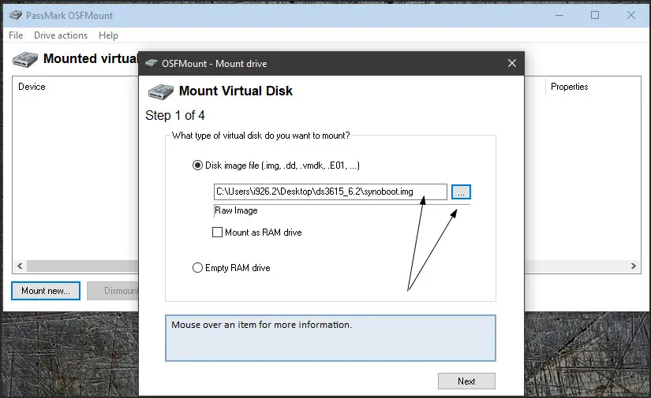

Выбираем необходимый нам раздел. В нём находится нужный нам для редакции файл **grub.cfg**

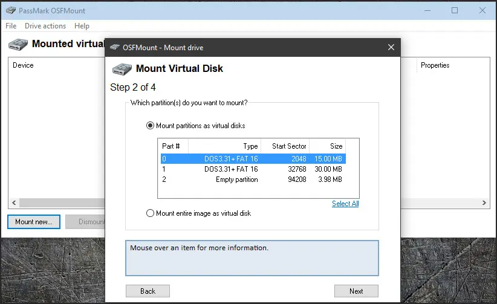

Обязательно снимаем галочку с опции: read only - только для чтения. Монтируем образ и открываем необходимый нам файл **grub.cfg**

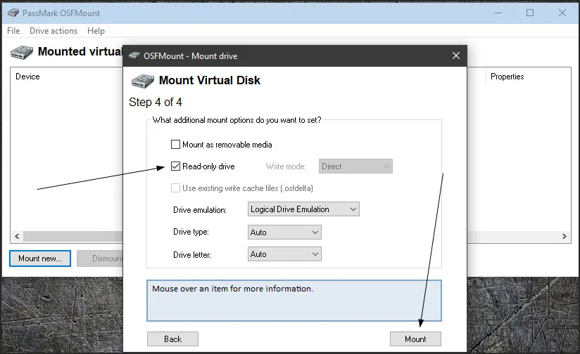

Редактируем в Notepad++

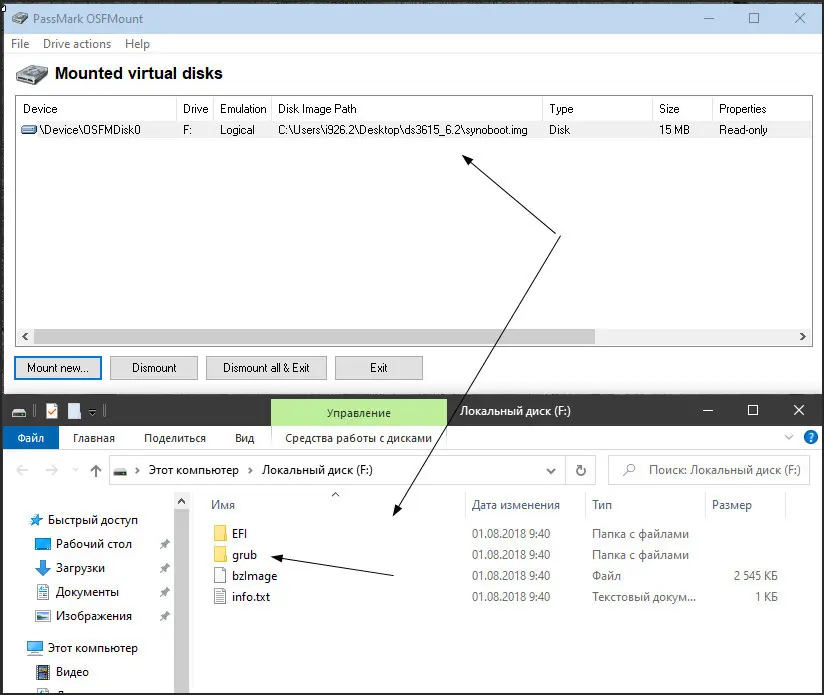

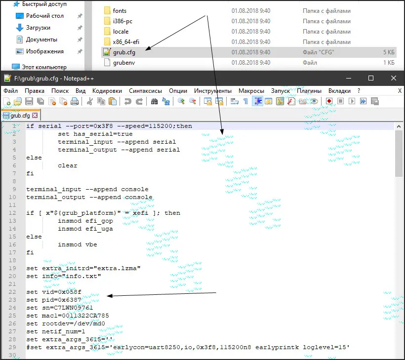

Редактируем значения:

-   `set vid=0x`(Ваш vid - обязательно)
-   `set pid=0x`(Ваш pid - обязательно)

!!! info
    К вопросу о значении "0x" (мнения разнятся).....  
    Загрузчик имеет исходный формат (0xabcd). Значение 0x говорит что это шестнадцатеричный код.  
    Если VID и PID вашей флешки состоит из цифр (1234), то без значения "0x" загрузчик работает , если имеются буквы (12АБ), то без значения "0x" может не сработать.  
    Потому лучше прописывайте VID и PID как в исходнике: "0xВаши данные"

!!! info "Где узнать vid и pid флешки"

    Получить vid и pid не сложно. Нужно воспользоваться одной из программ.

    [http://flashboot.ru/files/vidpid/](http://flashboot.ru/files/vidpid/)  
    [https://www.antspec.com/usbflashinfo/](https://www.antspec.com/usbflashinfo/)  
    [https://www.usbdev.ru/files/usbflashinfo/](https://www.usbdev.ru/files/usbflashinfo/)  
    [https://www.synology.com/ru-ru/knowledgebase/DSM/tutorial/Compatibility_Peripherals/How_do_I_check_the_PID_VID_of_my_USB_device](https://www.synology.com/ru-ru/knowledgebase/DSM/tutorial/Compatibility_Peripherals/How_do_I_check_the_PID_VID_of_my_USB_device)

-   `set sn=Ваш серийник`
-   `set mac1=Ваш mac1`
-   `set mac1=Ваш mac2,3,4` (если сетевая карта имеет больше одного порта)

Значения **set sn** и **set mac** можно оставить по дефолту, если вам не нужны такие функции, как транскодинг, Push уведомления и QuickConnect.

Можно вставить сгенерированный серийный номер из генератора: https://xpenogen.github.io/serial_generator/index.html

Так же, необязательно, но лучше отредактировать значение:

-   `set timeout='1'` - изменить значение "1" на другое, скажем на 5 или больше.  

Это значение отвечает на время видимости начального загрузчика из трёх пунктов. Многие не успевают прочесть то, что там написано.  
Изменение этого значения даст возможность увеличить время отображения начальной страницы

Отредактировав под себя **grub.cfg** , сохраняем его и размонтируем образ

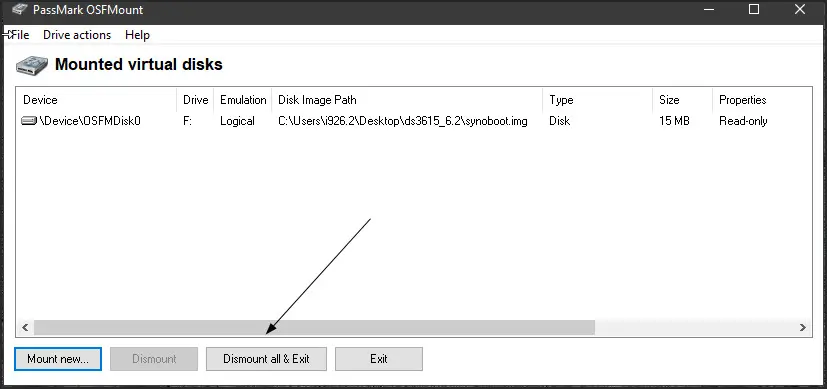

## Запись на флешку

Теперь можно записать загрузчик на флешку

Открываем , выбираем наш, уже правленый образ загрузчика и записываем на флешку. На скриншоте ниже, указано что выбрать.

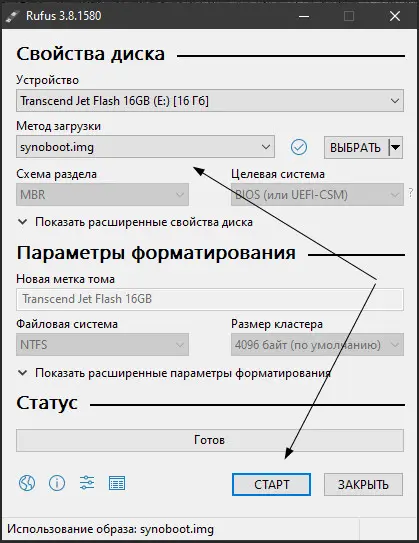

Ну вот и всё, загрузочная флешка готова. Можно начинать установку DSM

Из личного опыта.. Всегда сохраняйте свой, правленый образ загрузчика. Всякое может случиться и всегда полезно иметь уже готовый для записи образ.

## Установка Xpenology

Вставляем флешку с записанным загрузчиком во внутренний порт нашего Microserver gen10. Нужно подключить монитор, в UEFI отключить загрузку со всего, кроме нашей флешки.

После запустится установка. На мониторе будет "Happy Hacking" - Счастливый взлом. То есть всё хорошо.

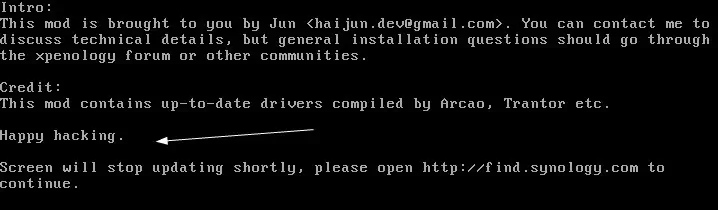

Далее, запускаем Synology Assistant для поиска своего сервера. Скачать можно по ссылке: https://archive.synology.com/download/Utility/Assistant/6.2-24922

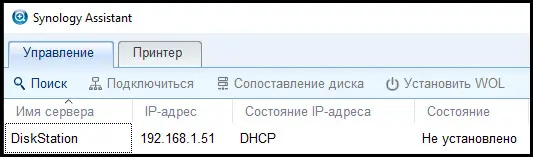

Нашли свой сервер, вошли по ip и запускаете дальнейшую установку. Нажимаем на кнопку **Установить**. Далее на **Установить вручную**

!!! warning "Важно"
    Выбирать только **Установка вручную**, иначе скачается последний образ и не запустится.

Необходимо указать файл с ОС DSM. Нужную нам версию можно скачать по ссылке: https://global.download.synology.com/download/DSM/release/6.2.1/23824/DSM_DS918%2B_23824.pat
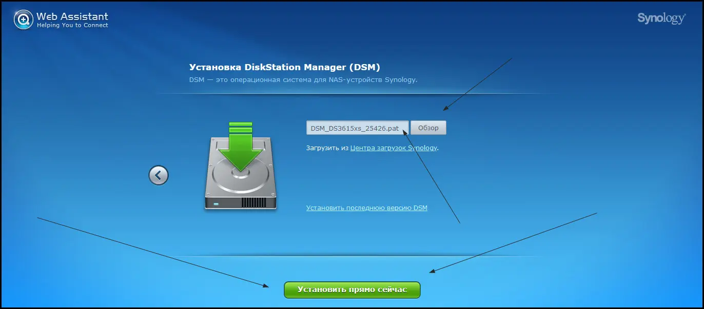

Соглашаемся, что данные на дисках будут удалены.

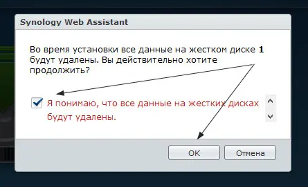

Установка долгая, может занять до 20 минут.

После того, как Xpenology установится, нужно будет создать учётную запись
Создаём учётную запись
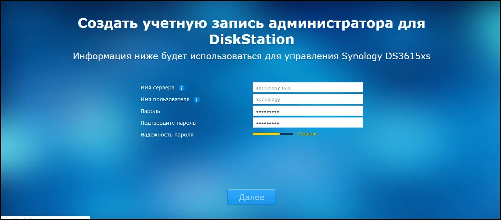

Предложение по созданию Synology QuickConnect'а отметаем, так как для его работы необходима Реальная Валидная пара. Снизу будет едва заметная кнопка.

Готово
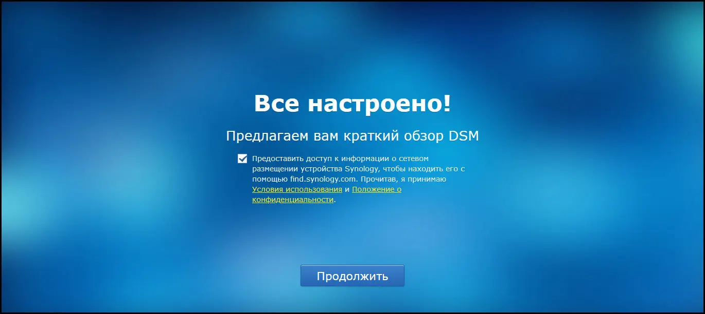

Дальнейшая настройка не сложная.

!!! danger 
    В Панели управления, DSM будет предлагать обновить версию до 6.2.4. Ни в коем случае не обновляемся. Загрузчика на эту версии НЕТ.

Настройку разделов провести в File Station, ничего сложного там нет, мастер проведет по всем шагам.

После настроек, советую открыть так называемый ROOT доступ: [https://www.synology.com/ru-ru/knowledgebase/DSM/tutorial/General_Setup/How_to_login_to_DSM_with_root_permission_via_SSH_Telnet](https://www.synology.com/ru-ru/knowledgebase/DSM/tutorial/General_Setup/How_to_login_to_DSM_with_root_permission_via_SSH_Telnet)