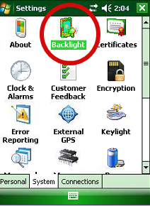
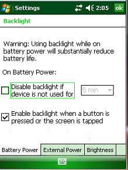
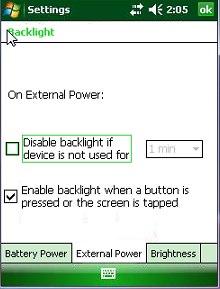
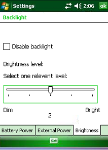
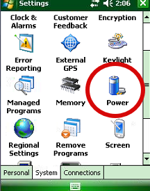
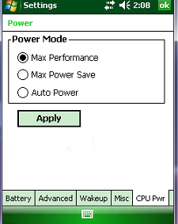

Теперь нам нужно установить необходимые программы на ТСД. Для этого вставляем ТСД в кредл, устанавливаем на ПК набор программ для работы кредла (папка `\1.Soft\Lync\`) ждем пока ТСД определится. После того, как ТСД в кредле определился, он стал доступен в ПК и на него можно удаленно зайти для просмотра файлов.

Копируем все файлы из папки `\2.Заливка ТСД\9200CE7\after Update\` в папку на ТСД **Application**, подтверждаем замену.

Выполняем импорт настроек, чтобы ТСД не засыпал и не просил калибровку после перезагрузки. Запускаем из папки **Application**  поочередно файлы:  `9190_NoCalibration+RadioOn.reg` и `NoSleepCE.reg`, соглашаемся со всем.

Для настройки энергопотребления терминала необходимо на ТСД зайти в настройки, выбрать **Backlight**.

На вкладке **Battery Power** убрать галочку со строчки **Disable backlight if device is not used for**.

Перейти на вкладку **External Power** и так же убрать галочку со строки **Disable backlight if device is not used for**.

Перейти на вкладку **Brightness** и выставить ползунок на двоечку.

Затем возвращаемся в меню настроек и выбираем пункт **Power**.

Здесь, во вкладке **Advanced**, ставим галочки на обоих пунктах и выбираем 5 минут из раскрывающегося списка.

Переходим на вкладку **CPU Power**, выбираем **Max Perfomance**, и нажимаем кнопку **Apply**.

