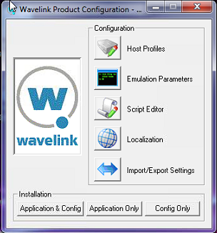
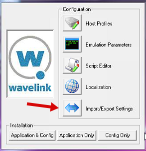
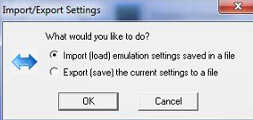
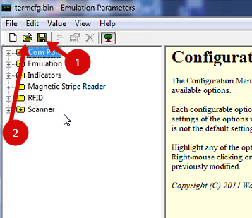

Теперь надо настроить **TelnetCE**, для этого на ПК куда подключен кредл, устанавливаем ПО из папки `\1.Soft\Wavelink\` . Нам нужен файл **MC 9200 CE 7.0**

Желательно ставить его и все другие программы в разные папки. Для примера `C:\Wavelink\mc9200_ce7\`

После установки запускаем программу. Выйдет окно

## Host Profile
Для начала нам требуется настроить **Host Profile**. Нажимаем на кнопку **Host Profile**  и открывается новое окно. Если в нем пусто, то нужно импортировать профиль. Если есть другие профили, то их удаляем (кроме случаем работы с несколькими профилями на ТСД). Далее закрываем окно и снизу нажимаем на кнопку  **Import/Export Settings**:

При нажатии выйдет сообщение о том, что мы хотим сделать. Выбираем **import** и нажимаем ОК. Путь к файлу с конфигом: `\4.OHE\OHI_eburg.wltna`

Для проверки настроек, заходим в **Host Profile**, название должно быть **OHI_WMS**, должны быть прописаны ваш адрес сервера протокол и порт. Остальное оставляем по умолчанию.

## Улучшение профиля

Заходим в **Emulation Parameters** и отрываем заранее сохраненный файл. Путь к файлу – `4.OHE\termcfg_my.bin`. После нажимаем на значок дискеты – **Save**

Краткое описание параметров, которые настроены в файле:

| Группа | Раздел | Параметр | Значение | Описание |
|--|--|--|--|--|
| Emulation | Common | Key Macros | из файла по пути \4.OHE\Функциональные клавиши (F) | Макросы для работы функц. клавиш. Напр F1-F10 |
| Emulation  | Display | Force black & white | Yes | Установка белого фона |
| Emulation  | Display  | Hide horizontal Scroll bar | Yes | Скрываем горизонтальную полосу прокрутки |
| Emulation  | Display  | Hide vertical scroll bar | Yes | Скрываем вертикальную полосу прокрутки |
| Emulation  | Display  | Hide menu | Yes | Скрываем системное меню |
| Emulation  | Display  | Menu toogle key | hex сочетание клавиш | Cочетание клавиш для вывода меню программы |
| Emulation  | Display  | Start Menu | Hide start menu | Скрывать меню Telnet |