Запускаем из папки **Application** файл обновления модуля Wi-Fi с помощью файла `FUSION_X_2.03.0.0.027R_MPA3_CE70`. Соглашаемся с путем установки и жмем ОК. После ТСД перезагрузится.

Для начальной настройки Wi-Fi подключения, нажимаем на значок в системном трее и выбираем **Manage Profile**:

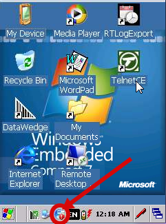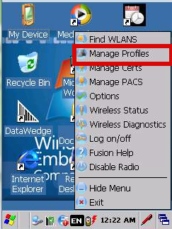

Видим соединение  **101**, выбираем его и удаляем.

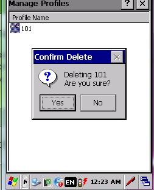

!!! tip "ВАЖНО!!!"
    Обязательно удаляем соединение 101 и создаём новое. Ни в коем случае не надо его редактировать, или оставлять вторым соединением.

Нажимаем стилусом на пустом окне и выбираем в меню **Add**.

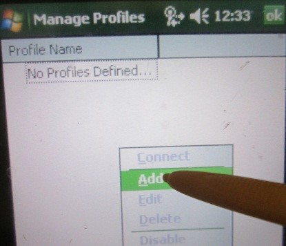

Название нового соединения ставим **105**. Далее буду приводить только те окна в который необходимо что-либо изменить.

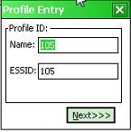

В этом окне **Security mode** меняем на **WPA2–Personal** и жмём Next.

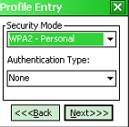
В следующем окне оставляем **AES/TKIP** выбираем **pass-phrase**, нажимаем next

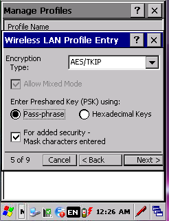

Вводим пароль доступа к сети Wi-Fi и нажимаем next.

Снимаем все галочки и нажимаем next.

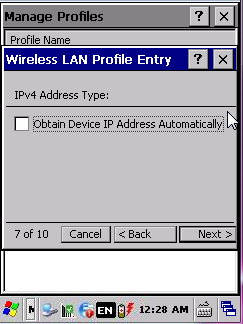

В следующем окне прописать статический IP- адрес, ввести маску, ввести шлюз, нажать некст

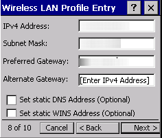

**Battery Usage** выбираем – **CAM** и нажимаем next.

На этом настройка соединения закончена. Выбираем созданное соединение и нажимаем коннект.

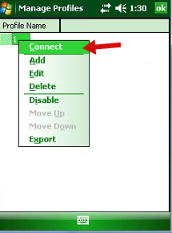

После первого присоединения к сети выскочит уведомление:

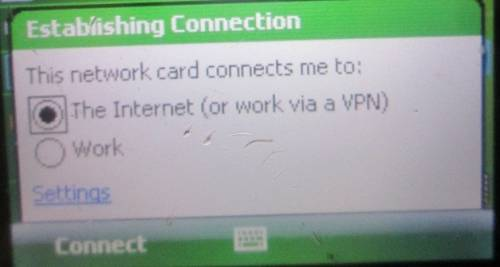

Выбираем **The internet** и нажимаем **Connect**.

Теперь необходимо сохранить настройки соединения в конфиг. Для этого вызываем меню соединения и выбираем **Options**.

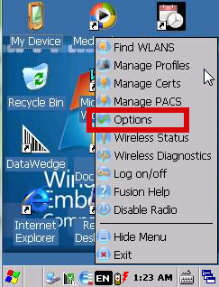

В открывшемся окне выбираем **Export**.

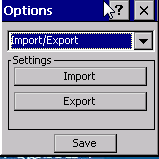

Ставим 1 2 3 4 и 6 галочки и нажимаем **Export to file**. В открывшемся окне нажимаем ОК.

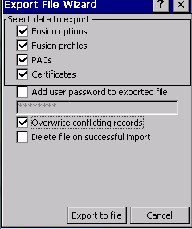

На этом настройка Wi-Fi завершена