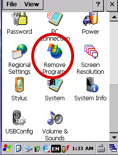

Для правильной установки, требуется удалить все текущие версии на ТСД, для этого идем в настройки и запускаем **Remove Program**

Удаляем **TelnetCE**, если он там есть.

Далее идем в **File Explorer**  и удаляем из всех мест  **Wavelink**:  `\Application\wavelink` и `program files\wavelink`

Переходим в окно программы **Wavelink product configuration**. Нажимаем кнопку **Application Only**  и ждем установки.

После завершения установки, устанавливаем подготовленный конфиг в терминал. Используем для этого кнопку внизу окна –  **Config Only**

## **Тюнинг ТСД**

Нам нужно, чтобы при перезагрузке запускался TelnetCE, для этого ярлык с рабочего стола копируем в папку `Application\Startup`