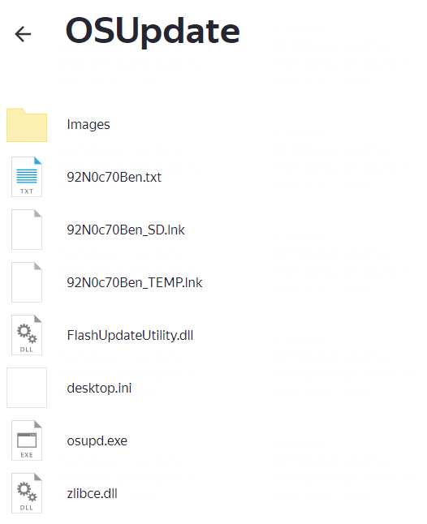
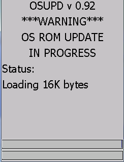

# Windows CE 7.0

требуется скачать файлы: из [шары](https://disk.yandex.ru/d/YiTDTxSRqo1ddQ) по пути: `\2.Заливка ТСД\9200CE7\OSUpdate`

Папку `OSUpdate` скопировать на microSD карту, объемом не более 16 Гб и вставить в слот. Слот находится под клавиатурой. Как снять клавиатуру описано [здесь](https://wiki.st1t.ru/ru/Hardware/TSD/Motorola/TSD-Motorola-repair-keyboard).

После этого, заходим в терминал, запускаем **File Explorer,** переходим на карту памяти в папку **OSUpdate** и запускаем файл `92N0c70Ben_SD`. Запустится процесс обновления файлов.

Вставляем ТСД в кредл или подключаем зарядку и ждем 3-7 минут. Столько занимает перезаливка.

!!! warning
    Обязательно подключаем зарядку или вставляем в крэдл. Если во время прошивки сядет АКБ, с большим шансом ТСД превратится в кирпич

После того, как ТСД перепрошился, он попросит выполнить стартовую калибровку.