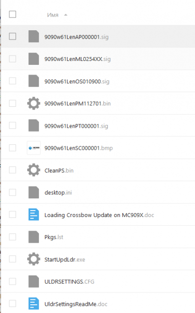

# Windows Mobile 6.1

Для того, чтобы перезалить проблемный ТСД, работающий на Windows Mobile 6.1, требуется скачать файлы: из [шары](https://cloud.st1t.ru/s/gpeP3WbwqbWnKjG) по пути: `2.Заливка ТСД/9090WM61/os`

Эти файлы скопировать на SD карту, объемом не более 2 Гб и вставить в слот. Слот находится под клавиатурой(открутить 2 винта в углах клавиатуры)

После этого, заходим в терминал, запускаем `File Explorer` переходим на карту памяти и запускаем файл `StartUpdLdr`. Вставляем ТСД в кредл и ждем 5-15 минут. Столько занимает перезаливка.

После того, как ТСД перезалился, он попросит выполнить стартовую калибровку.

Далее нам требуется залить все необходимые программы на ТСД и выполнить настройку Wi-Fi. Для этого снова вставляем ТСД в кредл, устанавливаем на ПК набор программ для работы кредла (папка `Soft/Lync`) ждем пока ТСД определится.

ТСД в кредле и определился, те на него можно удаленно зайти для просмотра файлов. Копируем все файлы из папки `2.Заливка ТСД/9090WM61/2` в папку на ТСД **`Application`**, подтверждаем замену.

На ТСД открываем File Explorer идем в папку `Application`, запускаем файл `Fusion_2.57.0.0.025B_WM61.ARM`, ставим все по умолчанию. По окончанию работы ТСД перезагрузится. После перезагрузки, удаляем файл `Fusion_2.57.0.0.025B_WM61.ARM`, чтобы очистить место.

На ТСД открываем File Explorer идем в папку Application, запускаем файл `TelnetCE_70120.ARM`, выбираем установку в `/Application`

Запускаем из папки **`Application`** поочередно файлы `9190_NoCalibration+RadioOn.reg` и `NoSleepCE.reg`, соглашаемся со всем.