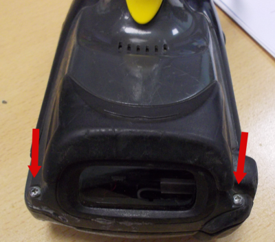
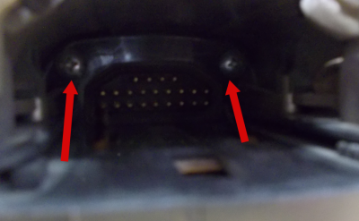
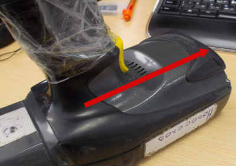
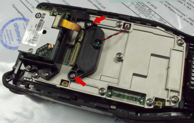
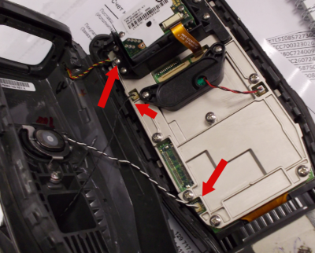
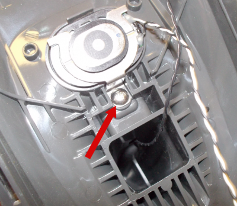
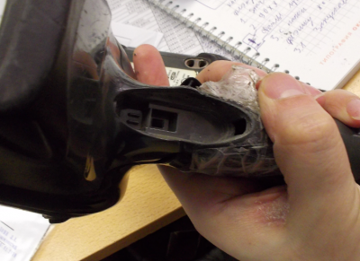

# Ремонт ТСД

## Замена бекап-батареи или курка

Для замены бекап-батареи или курка, необходимо вынуть АКБ, открутить 2 болта за АКБ, открутить 2 болта возле сканера, снять кожух движением от себя. Сниматься будет тяжело, главное делать это аккуратно:

=== "Для бекап-батареи"

    Откручиваем болты и меняем. Если не влезает, то оборачивает батарею поролоном и вставляем в рукоять кожуха.

    

=== "Для курка"
    откручиваем болт и отколупываем курок. Отключаем на мать плате.

    

    

    

    Новый вставляем в гнездо, продевая через отверстие кабель. Закручиваем болт. Подключаем на мат плате.

## Снятие клавиатуры

В 90% случаем если сбоит клавиатура, то помогает ее снятие и протирка контактов изопропиловым спиртом.

Если не помогло, то ее надо менять

Снятие клавиатуры в случае ее поломки, производится путем откручивания 2 болтов и снятием клавиатуры на себя:

![]../../images/other/tsd/repair_08.png)

Последовательность снятия клавиатуры