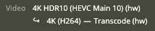

# NVidia Proxmox + LXC

Не так давно мне потребовалось добавить поддержку перекодировки в Plex, используя видеокарту. У меня уже был сервер Plex, который работал внутри Docker. Сам Docker стоял внутри LXC контейнера Proxmox. Перерыв кучу материалов и потратив не мало времени, решил сделать руководство.

Я предполагаю, что уже настроен хост Proxmox и LXC. Работает под управлением Debian 11 (Bullseye). В моем примере я буду запускать контейнер LXC с именем plex(ID 101) на моем хосте Proxmox. Все команды через терминал, без использования графического интерфейса. LXC получит привилегию `fuse=1,nesting=1` набора функций. В качестве видеокарты я буду использовать Nvidia GeForce 1050Ti. Все команды будут выполняться как root. 

!!! info "Запуск в rootless LXC"

    Обратите внимание, что могут потребоваться другие шаги, если вы попытаетесь запустить это в контейнере LXC без root-прав или непривилегированном.

## Proxmox хост

Первый шаг - это установка драйверов на хост. Хотя у Nvidia и есть официальный репозиторий Debian, который мы могли бы использьваоть, делать этого не будем. Потому что это может создать проблему - позднее нужно будет поставить в контейнер LXC драйверы, но без модулей ядра. Сделать это используя официальный репозиторий Debian я не смог. Поэтому будем устанавливать драйверы вручную. Другая проблема использования официального репозитория Debian - драйвер на хосте и в контейнере должны быть одной версии.

Для начала нужно отключить модуль ядра Nouveau, прежде чем сможем установить драйверы NVIDIA
```
echo -e "blacklist nouveau\noptions nouveau modeset=0" > /etc/modprobe.d/blacklist-nouveau.conf
update-initramfs -u
reboot
```
Устанавливаем пакеты, необходимые для сборки драйверов ядра NVIDIA (нужны только на хосте)
```
apt install build-essential
```
Установливаем заголовки pve, соответствующие вашему текущему ядру. Для старых версий нужно использовать `pve-headers-$(uname -r)`
```
apt install proxmox-headers-$(uname -r)
```

Скачиваем и устанавливаем драйвер nvidia. 550.54.14 был последним на момент написания статьи.
```
wget -O NVIDIA-Linux-x86_64-550.54.14.run  https://ru.download.nvidia.com/XFree86/Linux-x86_64/550.54.14/NVIDIA-Linux-x86_64-550.54.14.run
chmod +x NVIDIA-Linux-x86_64-550.54.14.run
./NVIDIA-Linux-x86_64-550.54.14.run --check
./NVIDIA-Linux-x86_64-550.54.14.run
```
!!! tip

    При установке, будет выбор что ставить дополнительно. В пунктах, перечисленных ниже, нужно ответить **No**

    - install 32bit compability drivers
    - should update X config

После установки драйверов нужно добавить несколько правил udev. Это необходимо для того, чтобы гарантировать загрузку правильных модулей ядра и создание всех соответствующих файлов устройств при загрузке.

``` title="добавляем модули ядра"
echo -e '\n# load nvidia modules\nnvidia-drm\nnvidia-uvm' >> /etc/modules-load.d/modules.conf
```
добавьте следующее в `/etc/udev/rules.d/70-nvidia.rules` - создаст соответствующие файлы устройств в `/dev/` во время загрузки
```
KERNEL=="nvidia", RUN+="/bin/bash -c '/usr/bin/nvidia-smi -L && /bin/chmod 666 /dev/nvidia*'"
KERNEL=="nvidia_uvm", RUN+="/bin/bash -c '/usr/bin/nvidia-modprobe -c0 -u && /bin/chmod 0666 /dev/nvidia-uvm*'"
SUBSYSTEM=="module", ACTION=="add", DEVPATH=="/module/nvidia", RUN+="/usr/bin/nvidia-modprobe -m"
```
Чтобы избежать выгрузки модуля драйвера/ядра всякий раз, когда графический процессор не используется, нужно запустить службу сохранения, предоставляемую Nvidia . Он становится доступен после установки драйвера.

Копируем и извлекаем.
```
cp /usr/share/doc/NVIDIA_GLX-1.0/samples/nvidia-persistenced-init.tar.bz2 . 
bzip2 nvidia-persistenced-init.tar.bz2 
tar -xf nvidia-persistenced-init.tar 
```
Удаляем старый.
```
rm /etc/systemd/system/nvidia-persistenced.service
```
Устанавливаем.
```
chmod +x nvidia-persistenced-init/install.sh
./nvidia-persistenced-init/install.sh
```
Проверка, что все ОК.
```
systemctl status nvidia-persistenced.service
rm -rf nvidia-persistenced-init*
```
Если до этого момента не было ошибок, то можно перезагрузить хост Proxmox. После перезагрузки, введя команду `nvidia-smi`, можно увидеть информацию про видеокарту.
```
root@pve1:~# nvidia-smi
Sat Mar  9 12:59:57 2024
+-----------------------------------------------------------------------------------------+
| NVIDIA-SMI 550.54.14              Driver Version: 550.54.14      CUDA Version: 12.4     |
|-----------------------------------------+------------------------+----------------------+
| GPU  Name                 Persistence-M | Bus-Id          Disp.A | Volatile Uncorr. ECC |
| Fan  Temp   Perf          Pwr:Usage/Cap |           Memory-Usage | GPU-Util  Compute M. |
|                                         |                        |               MIG M. |
|=========================================+========================+======================|
|   0  NVIDIA GeForce GTX 1050 Ti     On  |   00000000:03:00.0 Off |                  N/A |
|  0%   35C    P8             N/A /   75W |       4MiB /   4096MiB |      0%      Default |
|                                         |                        |                  N/A |
+-----------------------------------------+------------------------+----------------------+

+-----------------------------------------------------------------------------------------+
| Processes:                                                                              |
|  GPU   GI   CI        PID   Type   Process name                              GPU Memory |
|        ID   ID                                                               Usage      |
|=========================================================================================|
|  No running processes found                                                             |
+-----------------------------------------------------------------------------------------+
```
Проверим работу службы:
```
root@pve1:~# systemctl status nvidia-persistenced.service
● nvidia-persistenced.service - NVIDIA Persistence Daemon
     Loaded: loaded (/lib/systemd/system/nvidia-persistenced.service; enabled; vendor preset: enabled)
     Active: active (running) since Sat 2024-03-09 00:38:15 +05; 12h ago
    Process: 1543 ExecStart=/usr/bin/nvidia-persistenced --user nvidia-persistenced (code=exited, status=0/SUCCESS)
   Main PID: 1546 (nvidia-persiste)
      Tasks: 1 (limit: 76887)
     Memory: 944.0K
        CPU: 328ms
     CGroup: /system.slice/nvidia-persistenced.service
             └─1546 /usr/bin/nvidia-persistenced --user nvidia-persistenced

Mar 09 00:38:14 ekb-pve1 systemd[1]: Starting NVIDIA Persistence Daemon...
Mar 09 00:38:14 ekb-pve1 nvidia-persistenced[1546]: Started (1546)
Mar 09 00:38:15 ekb-pve1 systemd[1]: Started NVIDIA Persistence Daemon.
```
Проверим, что появились устройства в `/dev/`
```
root@pve1:~# ls -alh /dev/nvidia*
crw-rw-rw- 1 root root 195,   0 Mar  9 00:38 /dev/nvidia0
crw-rw-rw- 1 root root 195, 255 Mar  9 00:38 /dev/nvidiactl
crw-rw-rw- 1 root root 195, 254 Mar  9 00:38 /dev/nvidia-modeset
crw-rw-rw- 1 root root 511,   0 Mar  9 00:38 /dev/nvidia-uvm
crw-rw-rw- 1 root root 511,   1 Mar  9 00:38 /dev/nvidia-uvm-tools

/dev/nvidia-caps:
total 0
drwxr-xr-x  2 root root     80 Mar  9 00:38 .
drwxr-xr-x 21 root root   5.0K Mar  9 03:03 ..
cr--------  1 root root 236, 1 Mar  9 00:38 nvidia-cap1
cr--r--r--  1 root root 236, 2 Mar  9 00:38 nvidia-cap2
```
Понять что все хорошо - есть минимум 5 файлов `/dev/nvidia*`.

## LXC-контейнер

Теперь, нужно добавить конфигурацию в LXC-контейнер. Останаливаем работу контейнера и вносим изменения в файле конфигурации LXC.

Отредактируем `/etc/pve/lxc/101.conf` и добавим:
```
lxc.cgroup2.devices.allow: c 195:* rwm
lxc.cgroup2.devices.allow: c 237:* rwm
lxc.cgroup2.devices.allow: c 240:* rwm
```
Монтирование устройств nvidia в контейнер LXC 
```
lxc.mount.entry: /dev/nvidia0 dev/nvidia0 none bind,optional,create=file
lxc.mount.entry: /dev/nvidiactl dev/nvidiactl none bind,optional,create=file
lxc.mount.entry: /dev/nvidia-modeset dev/nvidia-modeset none bind,optional,create=file
lxc.mount.entry: /dev/nvidia-uvm dev/nvidia-uvm none bind,optional,create=file
lxc.mount.entry: /dev/nvidia-uvm-tools dev/nvidia-uvm-tools none bind,optional,create=file
lxc.mount.entry: /dev/nvidia-caps/nvidia-cap1 dev/nvidia-caps/nvidia-cap1 none bind,optional,create=file
lxc.mount.entry: /dev/nvidia-caps/nvidia-cap2 dev/nvidia-caps/nvidia-cap2 none bind,optional,create=file
```
Числа в строках с `cgroup2` взяты из 5 столбца в списках устройств выше (команда `ls -alh /dev/nvidia*`)

После запускаем контейнер и приступаем к установке драйева Nvidia. Будем ставить без драйеверов ядра.
```
dpkg --add-architecture i386
apt update
apt install libc6:i386
wget -O NVIDIA-Linux-x86_64-550.54.14.run  https://ru.download.nvidia.com/XFree86/Linux-x86_64/550.54.14/NVIDIA-Linux-x86_64-550.54.14.run
chmod +x NVIDIA-Linux-x86_64-550.54.14.run
./NVIDIA-Linux-x86_64-550.54.14.run --check
./NVIDIA-Linux-x86_64-550.54.14.run --no-kernel-module
```
Как и для хоста, отказываем от обновления конфигурации X

После, выполняем reboot контейнеру LXC. Проверим, что все работает используя `ls -alh /dev/nvidia*` и `nvidia-smi`. Вывод будет таким же, как и для хоста.

## Docker контейнер

Буду считать, что Plex уже работает, но транскодинг выполняется на процессоре. 

Нужно установить **NVIDIA Container Toolkit**:
```
apt install -y curl
curl -fsSL https://nvidia.github.io/libnvidia-container/gpgkey | sudo gpg --dearmor -o /usr/share/keyrings/nvidia-container-toolkit-keyring.gpg
curl -s -L https://nvidia.github.io/libnvidia-container/stable/deb/nvidia-container-toolkit.list | sed 's#deb https://#deb [signed-by=/usr/share/keyrings/nvidia-container-toolkit-keyring.gpg] https://#g' | tee /etc/apt/sources.list.d/nvidia-container-toolkit.list

apt update
apt install nvidia-container-toolkit

nvidia-ctk runtime configure --runtime=docker

systemctl daemon-reload
systemctl restart docker
```
Проверить, что Docker работает с поддержкой GPU можно через контейнер:
```
user@media:~$ docker run --rm --gpus all nvidia/cuda:11.0.3-base nvidia-smi
Sat Mar  9 08:17:54 2024
+-----------------------------------------------------------------------------------------+
| NVIDIA-SMI 550.54.14              Driver Version: 550.54.14      CUDA Version: 12.4     |
|-----------------------------------------+------------------------+----------------------+
| GPU  Name                 Persistence-M | Bus-Id          Disp.A | Volatile Uncorr. ECC |
| Fan  Temp   Perf          Pwr:Usage/Cap |           Memory-Usage | GPU-Util  Compute M. |
|                                         |                        |               MIG M. |
|=========================================+========================+======================|
|   0  NVIDIA GeForce GTX 1050 Ti     Off |   00000000:03:00.0 Off |                  N/A |
|  0%   35C    P8             N/A /   75W |       4MiB /   4096MiB |      0%      Default |
|                                         |                        |                  N/A |
+-----------------------------------------+------------------------+----------------------+

+-----------------------------------------------------------------------------------------+
| Processes:                                                                              |
|  GPU   GI   CI        PID   Type   Process name                              GPU Memory |
|        ID   ID                                                               Usage      |
|=========================================================================================|
|  No running processes found                                                             |
+-----------------------------------------------------------------------------------------+
```

## Plex + GPU

Нужно внести допстрочки в файл docker-compose, чтобы Plex начал видеть нашу видеокарту. Я приведу полный пример, как в итоге должен выглядеть файл.

```yaml hl_lines="10-14 29 30"
version: "3.7"

services:
  plex:
    container_name: plex
    image: linuxserver/plex:latest 
    profiles:
      - plex
    restart: unless-stopped
    runtime: nvidia # закоментить, если образ plexinc/pms-docker
    # Использование строк ниже, если образ plexinc/pms-docker
    #deploy:
    #  resources:
    #    reservations:
    #      devices:
    #        - capabilities: [gpu]
    ports:
      - "32400:32400"
      - "32400:32400/udp"
    security_opt:
      - no-new-privileges:true
    volumes:
      - ./plex:/config
      - ./plex/temp:/transcode
      - /mnt:/mnt:ro
    environment:
      - ADVERTISE_IP="http://172.18.1.250:32400/"
      - PUID=$PUID
      - PGID=$PGID
      - TZ=$TZ
      - VERSION=docker
      - PLEX_CLAIM=$PLEX_CLAIM
      - NVIDIA_VISIBLE_DEVICES=all
      - NVIDIA_DRIVER_CAPABILITIES=compute,video,utility
```

Проверить что все работает, можно зайдя на свой сервер Plex и запустить какой нить фильм. В статистике, будет что то типо такого:



## Обновление

Каждый раз, когда обновляется ядро, нужно переустановить драйвер на хосте Proxmox. При установке той же версии, что и стояла изначально, процесс прост: перезапустить исходную установку драйвера. В контейнере LXC ничего делать не нужно, так как версия остается той же)
```
./NVIDIA-Linux-x86_64-550.54.14.run
reboot
```

### Обновление драйвера

При обновлении драйвера Nvidia, нужно выполнеить несколько дополнительных шагов. Если на хосте Proxmox уже есть работающий драйвер, то нужно для анчала удалить старый драйвер (иначе будут проблемы: при выгрузке модуля, будет происходить моментальная его загрузка обратно)

Удалим старый драйвер
```
./NVIDIA-Linux-x86_64-510.47.03.run --uninstall
reboot
```
Если было обновление ядра, то нужно скачать заново заголовки. Для старых версий нужно использовать `pve-headers-$(uname -r)`
```
apt install proxmox-headers-$(uname -r)
```
Установим новую версию. Для примера версия та же что и выше.
```
wget -O NVIDIA-Linux-x86_64-550.54.14.run  https://ru.download.nvidia.com/XFree86/Linux-x86_64/550.54.14/NVIDIA-Linux-x86_64-550.54.14.run
chmod +x NVIDIA-Linux-x86_64-550.54.14.run
./NVIDIA-Linux-x86_64-550.54.14.run --check
./NVIDIA-Linux-x86_64-550.54.14.run
reboot
```
!!! tip

    При установке, будет выбор что ставить дополнительно. В пунктах, перечисленных ниже, нужно ответить **No**

    - install 32bit compability drivers
    - should update X config

После перезагрузки, проверим что все работает, используя `nvidia-smi`

Проверим, что номера cgroup не изменились. если нужно, то меняем их под новые значения в файле конфигурации LXC

Далее, обновляем драйвера в контейнере LXC

```
wget -O NVIDIA-Linux-x86_64-550.54.14.run  https://ru.download.nvidia.com/XFree86/Linux-x86_64/550.54.14/NVIDIA-Linux-x86_64-550.54.14.run
chmod +x NVIDIA-Linux-x86_64-550.54.14.run
./NVIDIA-Linux-x86_64-550.54.14.run --check
./NVIDIA-Linux-x86_64-550.54.14.run --no-kernel-module
```
Как и для хоста, отказываем от обновления конфигурации X

После, выполняем reboot контейнеру LXC. Проверим, что все работает используя `ls -alh /dev/nvidia*` и `nvidia-smi`. Вывод будет таким же, как и для хоста.

Обновим **NVIDIA Container Toolkit**:
```
curl -fsSL https://nvidia.github.io/libnvidia-container/gpgkey | gpg --dearmor -o /usr/share/keyrings/nvidia-container-toolkit-keyring.gpg
curl -s -L https://nvidia.github.io/libnvidia-container/stable/deb/nvidia-container-toolkit.list | sed 's#deb https://#deb [signed-by=/usr/share/keyrings/nvidia-container-toolkit-keyring.gpg] https://#g' | tee /etc/apt/sources.list.d/nvidia-container-toolkit.list

apt update
apt install nvidia-container-toolkit
apt upgrade
```
Перезагружаем контейнер LXC. Все должно рбаотать с новым драйвером.