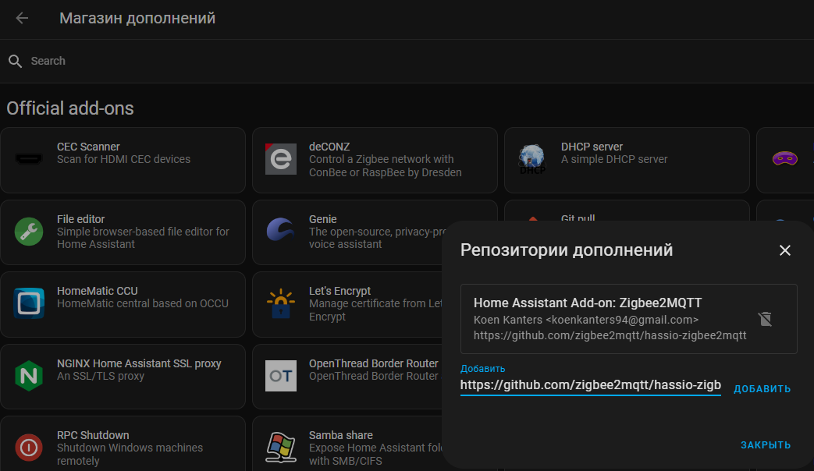

# Zigbee2mqtt - установка и обновление в Home Assistant

Чтоб установить актуальную версию, нам нужно зайти в магазин дополнений и добавить туда новую ссылку: `https://github.com/zigbee2mqtt/hassio-zigbee2mqtt`

После добавления этой ссылки в репозитории, необходимо перезапустить Home Assistant.

После перезапуска, у нас появится новый аддон zigbee2mqtt, который можно установить. Перед установкой старый можно не удалять, достаточно его выключить.

!!! warning

    Если есть какие-то аддоны или надстройки, что используют стик Zigbee, их надо отключить. Иначе работать Zigbee2mqtt не будет

