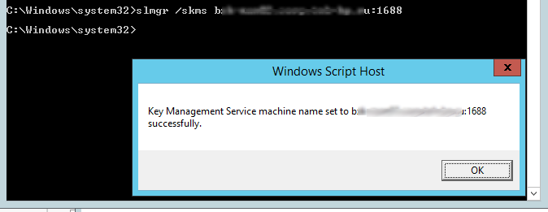
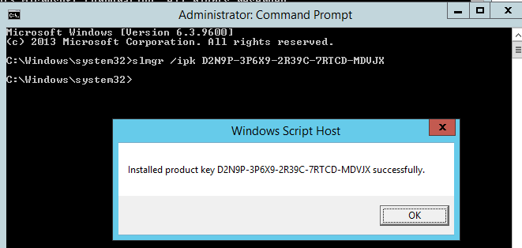
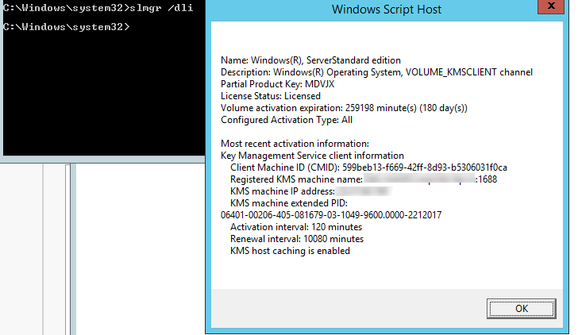
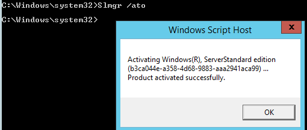

# KMS

## Указание адреса KMS сервера

В том случае, если в DNS вашего домена имеется корректная SRV запись, которая позволяет клиентам найти KMS сервер, этот шаг можно пропустить.

!!! tip "Совет" 
    Проверить наличие такой записи в DNS можно помощью утилиты **nslookup** такой командой: `nslookup -q=SRV _VLMCS._TCP.example.com`

Если клиент не может найти KMS сервер автоматически, можно указать адрес и порт (по умолчанию 1688) KMS сервера вручную:
```
slmgr.vbs /skms <имя_или_IP_адрес_KMS_сервера>:1688
```



## Типичные проблемы при KMS активации

Наиболее часто пользователи Windows сталкиваются со следующими ошибками при активации операционной системы на KMS сервере:

-   `0xC004F074` – служба KMS недоступна. Это означает, что служба KMS на указанном сервере не запущена, либо доступ к нему ограничен. Рекомендуется проверить, что с клиента на сервере доступен TCP порт 1688 (по умолчанию)
-   `0xC004F038` – в сети недостаточно клиентов для активации. Чтобы KMS сервер начал выдавать лицензии, необходимо, чтобы к нему за активацией обратилось как минимум 25 компьютеров с клиентскими версиями Windows или 5 клиентов с Windows Server.

## Список KMS ключей клиентов

Актуальные ключи доступны [тут](https://docs.microsoft.com/ru-ru/windows-server/get-started/kms-client-activation-keys#generic-volume-license-keys-gvlk)

## Смена MAK ключа на KMS

В первую очередь необходимо изменить ключ продукта (имеется в виду Windows) на один из общедоступных **KMS Client Setup Key**. Для каждой редакции Windows используется свой уникальный ключ.

Откройте командную строку с правами администратора и наберите следующую команду:
```
slmgr.vbs /ipk XXXXX-XXXXX-XXXXX-XXXXX-XXXXX
```
где XXXX — KMS ключ для вашей версии и редакции Windows, который нужно взять из таблицы в конце статьи.

Например, для активации Windows Server 2012 R2 на KMS сервере нужно задать ключ этой редакции Windows такой командой:
```
slmgr.vbs /ipk D2N9P-3P6X9-2R39C-7RTCD-MDVJX
```


## Проверка статуса KMS активации

Если вы хотите проверить активирована ли ваша Windows, текущий статус активации системы можно получить с помощью команды:
```
slmgr.vbs /dli
```


В данном случае, видно, что система активирована на KMS сервере, а ее активация истекает через 180 дней.

## Активация Windows на указанном KMS сервере

Чтобы активировать Windows на указанном **KMS** сервере, выполните команду:
```
Slmgr.vbs /ato
```
И дождитесь появления надписи *Product activated successfully*

