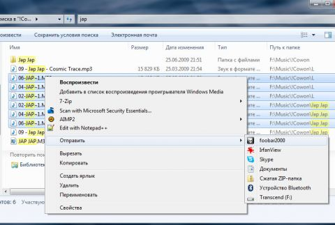

# Фишки функции Отправить (Send To)

## «Открыть с помощью» для нескольких файлов

Иногда необходимо открыть или отправить файлы в другую программу, отличную от той, что используется по умолчанию. Если выделить файл и нажать правой кнопкой мыши, то не в меню не окажется пункта «Открыть с помощью». В Windows 7 он доступен только для одного файла.

Можно, конечно, открыть проигрыватель и перетащить в него файлы мышью. Но меню будет удобнее. Например, это актуально для программ, группирующих окна на панели задач.

Данную проблему можно решить 2 путями - через реестр и то, как описано ниже. Способ через реестр страшный и его рассматривать пока не будем.

Это делается очень просто.

Создайте ярлык к программе, в которой вы хотите открывать файлы. Щелкните по исполняемому файлу правой кнопкой мыши и выберите в меню пункт **Создать ярлык**.

В **Пуск – Поиск** введите `shell:sendto` **-** откроется папка **SendTo**, содержащая несколько ярлыков.

Скопируйте или переместите ярлык в эту папку.

Теперь выделите несколько файлов, щелкните правой кнопкой мыши и выберите ваш ярлык в меню **Отправить**. Файлы откроются в указанной программе.

Можно не ограничиваться ярлыками программ. Если у вас есть любимые папки, их ярлыки тоже можно поместить в папку **SendTo**, что позволит копировать и перемещать в них файлы.

Но не спешите создавать ярлыки папок – возможно, они уже есть в меню, просто скрыты по умолчанию.

## **Вариант для Outlook**

создаем ярлык для **Outlook** и прописываем параметры:

`/c ipm.note /a` где назначение ключей:

-   `/c ipm.note` - создать электронное сообщение;
-   `/a `\- Создание элемента с указанным файлом в качестве вложения.