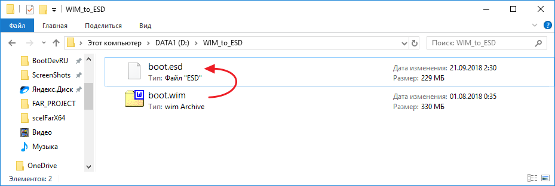
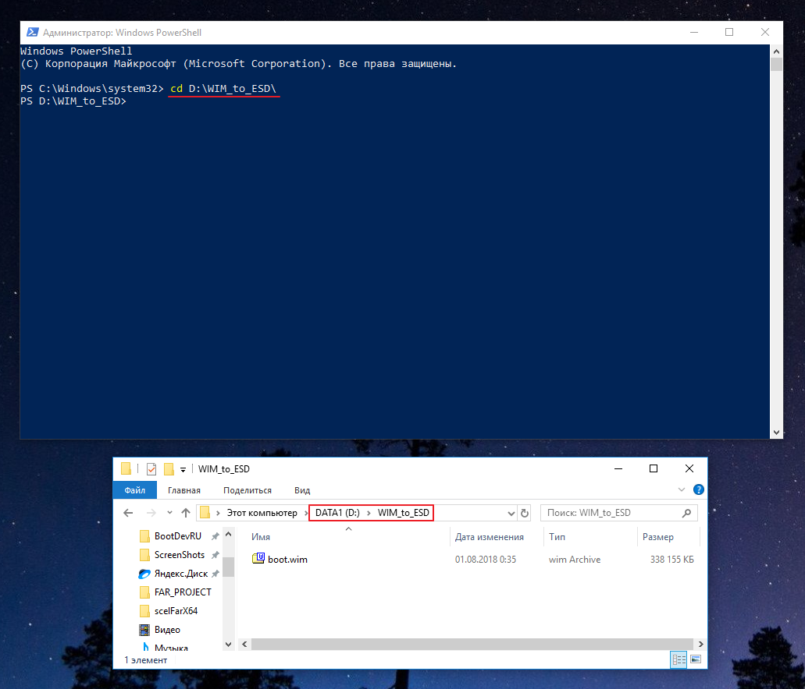
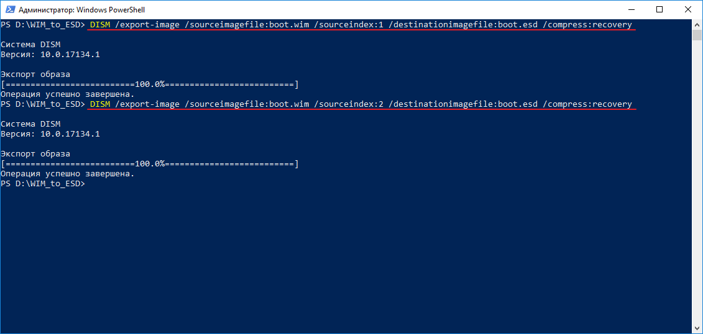
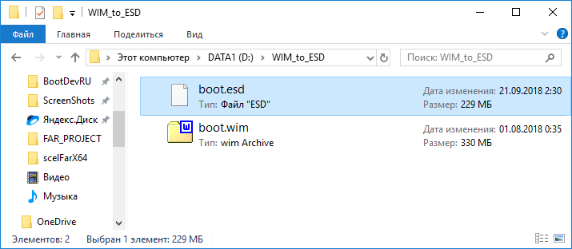
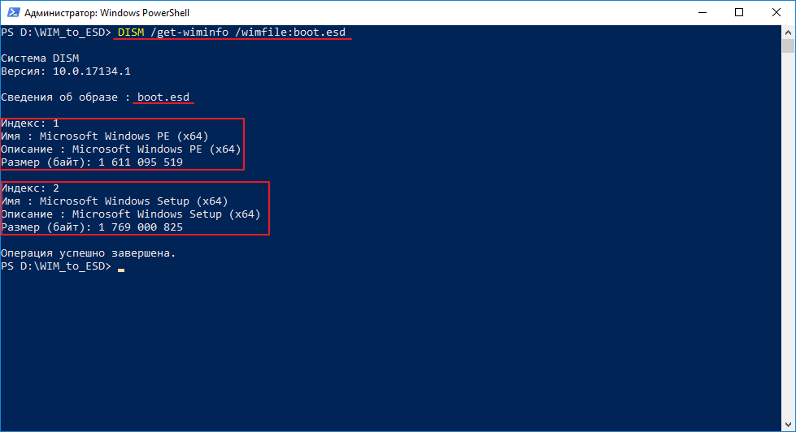

# Конвертирование WIM в ESD

!!! note
    Как сконвертировать файл `*.WIM` в `*.ESD` с помощью программы **DISM**?



Для выполнения конвертирования необходимо открыть командную строку от имени администратора. Можно как обычный **CMD**, так и **PowerShell**.

В открывшейся командой строке выполняем переход в директорию содержащую целевой WIM-архив. В моем случае это каталог `D:\WIM_to_ESD`.

```plaintext
cd D:\WIM_to_ESD\
```



Данный каталог содержит файл **boot.wim**, который необходимо сконвертировать в формат `*.ESD`. Файл взят исключительно для примера. Выполняем команду получения информацию о архиве **boot.wim**.

```plaintext
DISM /get-wiminfo /wimfile:boot.wim
```


Данная информация необходима для выполнения команды экспорта существующих индексов (образов) архива **boot.wim**, в новый архив **boot.esd**. Выполняем поочередно команду экспорта для каждого индекса.

```plaintext
DISM /export-image /sourceimagefile:boot.wim /sourceindex:1 /destinationimagefile:boot.esd /compress:recovery

DISM /export-image /sourceimagefile:boot.wim /sourceindex:2 /destinationimagefile:boot.esd /compress:recovery
```



Экспорт выполнен. Обратите внимание на размер полученного **boot.esd** файла. Он на 30% (~100 МБ) меньше файла **boot.wim**.



Все дело в том, что ESD-формат использует более эффективный алгоритм сжатия **LZMS**, вместо **LZX** у WIM.

Выведем информацию о только что созданном архиве **boot.esd**, чтобы убедиться что все необходимые индексы образы присутствуют в нем.

```plaintext
DISM /get-wiminfo /wimfile:boot.esd
```



Конвертирование файла `*.WIM` в `*.ESD` на этом можно считать завершенным.