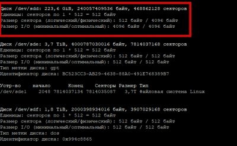

# Добавление диска

Потребовалось добавить дополнительный диск в систему, система работает на Ubuntu 22

Первым делом посмотрим какие диски у нас есть в системе

```plaintext
fdisk -l
```



## Создаем GPT

Открываем наш диск утилитой parted:

```plaintext
parted /dev/sdb
```

Откроется интерактивное меню утилиты — нажимаем `p`

```plaintext
(parted) p
```

На экран будет выведена информация о разделах. Если они есть, удаляем командой `rm`

```plaintext
(parted) rm 1
```

-   где `1` — номер раздела. Команду нужно повторить для всех разделов. Их список мы смотрели на предыдущем шаге командой `p`.
-   если на разделе есть важная информация, ее нужно скопировать на другой носитель.

Создаем разметку GPT:

```plaintext
(parted) mklabel gpt
```

После выходим:

```plaintext
(parted)quit
```

## Создадим таблицу разделов

```plaintext
fdisk /dev/sdd
```

Выводим справку по работе с диском, нажимаем (m)

```plaintext
Действие команды
a переключение флага загрузки
b редактирование метки диска bsd
c переключение флага dos-совместимости
d удаление раздела
l список известных типов файловых систем
m вывод этого меню
n добавление нового раздела
o создание новой пустой таблицы разделов DOS
p вывод таблицы разделов
q выход без сохранения изменений
s создание новой чистой метки диска Sun
t изменение id системы раздела
u изменение единиц измерения экрана/содержимого
v проверка таблицы разделов
w запись таблицы разделов на диск и выход
x дополнительная функциональность (только для экспертов)
```

Нас интересует «n добавление нового раздела», вводим `n`

Далее указываем какой будет создаваемый раздел

```plaintext
Действие команды
e расширенный
p основной раздел (1-4)
```

Указываем как основной раздел, вводим `p`

```plaintext
Номер раздела (1-4, по умолчанию 1):
```

Задаем номер раздела или нажимаем Enter чтобы использовать значение по умолчанию (1), если 1 уже занят, то вводим другое значение.

```plaintext
Первый сектор (2048-1048575999, по умолчанию 2048):
```

Нажимаем Enter используя значение по умолчанию, но можно и в ручную указать значение первого сектора.

```plaintext
Last сектор, +секторы or +size{K,M,G} (2048-1048575999, по умолчанию 1048575999):
```

Нажимаем Enter используя значение по умолчанию, но можно и в ручную указать значение последнего сектора.

После всех проделанных действий вводим `w` что означает сохранить настройки и выйти.

```plaintext
Команда (m для справки): w
Таблица разделов была изменена!
Вызывается ioctl() для перечитывания таблицы разделов.
Синхронизируются диски.
```

Мы создали раздел на добавленном жестком диске, посмотрим что у нас получилось вводим `fdisk -l`

Видим что раздел создан. Переходим к форматированию созданного раздела.

## Форматирование в ext4

Воспользуемся командой **mkfs**

Отформатируем наш `/dev/sdb1` в **ext4**, для этого выполним следующую команду:

```plaintext
mkfs.ext4 /dev/sdb1
```

Видим что все прошло успешно. Теперь смонтируем устройство к нашей системе.

Выполним это с помощью команды mount

```plaintext
mount -t ext4 /dev/sdb1 /usr/data
```

-   `-t ext4` — указываем файловую систему подключаемого диска
-   `/dev/sdb1` — Собственно, сам раздел который мы подключаем
-   `/usr/data` — Точка монтирования место куда подключается наш раздел

для размонтирования диска используем команду umount указав диск

```plaintext
umount /dev/sdb1
```

Проверили диск работает успешно, теперь сделаем автоматическую монтировку его в систему.

```plaintext
sudo nano /etc/fstab
```

Переходим на новую строчку и добавляем строку такого вида:

```plaintext
/dev/sdb1 /usr/data ext4 defaults 1 2
```

Информация по строке:

-   `/dev/sdb1` — наш раздел, диск.
-   `/usr/data` — точка монтирования, где будут файлы с нашего диска.
-   `ext4` — файловая система, на примонтированном диске.
-   `defaults `— все опции по умолчанию.
-   `1 2` — Вспомогательные числа.

Описание опций defaults и вспомогательных чисел

-   **defaults** Использовать настройки по умолчанию (rw,suid,dev,exec,auto,nouser,async)
-   **rw / ro** — Разрешено чтение и запись / Разрешено только чтение
-   **suid / nosuid** — Разрешение / Блокировка работы suid, и sgid бит
-   **dev / nodev** — Интерпретировать / не интерпретировать блок специальных устройств на файловой системе.
-   **exec / noexec** — Разрешить выполнять двоичные файлы находящиеся на этом диске / Запретить
-   **auto / noauto** — Устройство будет устанавливаться автоматически при загрузке / Не будет
-   **nouser / user** — Запрещение монтирование от всех кроме root (nouser) / Разрешение монтировать от лица любого пользователя
-   **async / sync** — Запись и чтение на диске будут производиться асинхронно / Синхронно

Вспомогательные числа:

-   1 число — Возможные значения 0 или 1 — означает, включить/выключить резервное копирование файловой системы при помощи команды dump. Устаревшая опция.
-   2 число — Возможные значения 0, 1, 2, — означает порядок, в котором файловая система должна быть проверена при загрузке:
-   0 — не проверять.
-   1 — должна проверяться первой и использоваться как корневая.
-   Для всех остальных систем ставится 2.

Перезагружаемся и проверяем.

Выставим права на папку, дабы мы могли туда записывать данные не только под рутом

```plaintext
sudo chmod -R 777 /usr/data/
sudo chown -R nobody:nogroup /usr/data/
```