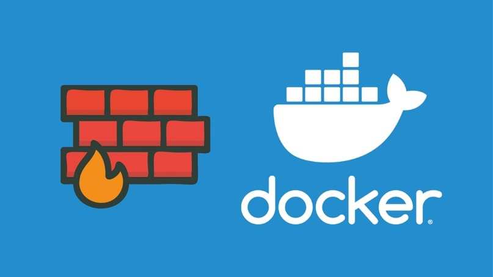

Как использовать Docker с UFW одновременно



Удивительно, но Docker не работает из коробки с “Universal Firewall” Linux, или UFW.
## Почему Docker не работает с UFW?
UFW задуман как очень простой брандмауэр.

Проблема в том, что UFW и Docker пытаются изменить одни и те же базовые правила брандмауэра. И этот конфликт требует дополнительной настройки, если вы хотите запустить UFW и Docker вместе.

При настройке базового брандмауэра UFW на запрет по умолчанию и разрешению SSH, это будет выглядеть, что все безопасно. Но это не будет блокировать запуск контейнеров Docker на других портах

Сложно диагностировать эту проблему, тк в UFW и Docker – это отдельные системы.

> UFW неосознанно обманывает вас и не показывает открытые порты контейнеров Docker.

Это может стать серьезной проблемой, если вы не решите ее.

Например: при запуске дашборда администратора на порту 8000 и добавлении правила только на доступ с определенных ip адресов (белый список). В обычных условиях все будет хорошо, особенно если дашборд имеет собственную аутентификацию. UFW покажет правило брандмауэра, как внесенное в белый список. Дашборд будет доступен вам с тех адресов, которые вы указали в правиле. **НО, если запущено через Docker, то по умолчанию оно будет видно на порту 8000 из любого места**.

## Исправление конфигурации Docker
Есть решение, которое предлагает Docker: отредактируйте _/etc/default/docker_ или _/etc/docker/daemon.json_ и просто отключите функциональность iptables в Docker:

```
DOCKER_OPTS="--iptables=false"
```
Это работает, однако это лишь половинчатое решение.

Это лишает Docker возможности управлять собственными сетями и может привести к тому, что контейнеры вообще не смогут получить доступ в интернет из коробки.

Это все еще может работать, но вам придется вручную поддерживать правила iptables для контейнеров Docker и пользовательских сетей, что сложно, раздражает и лишает цель простоты UFW.

Реальное решение сложное, но, к счастью, достаточно распространенное, поэтому на [Github](https://github.com/chaifeng/ufw-docker) есть полезная публикация с подробным описанием проблемы и шагов по ее устранению.

По сути, вам нужно изменить конфигурацию UFW в _/etc/ufw/after.rules_ и добавить следующий блок в конце:

```
# BEGIN UFW AND DOCKER
*filter
:ufw-user-forward - [0:0]
:ufw-docker-logging-deny - [0:0]
:DOCKER-USER - [0:0]
-A DOCKER-USER -j ufw-user-forward
-A DOCKER-USER -j RETURN -s 10.0.0.0/8
-A DOCKER-USER -j RETURN -s 172.16.0.0/12
-A DOCKER-USER -j RETURN -s 192.168.0.0/16
-A DOCKER-USER -p udp -m udp --sport 53 --dport 1024:65535 -j RETURN
-A DOCKER-USER -j ufw-docker-logging-deny -p tcp -m tcp --tcp-flags FIN,SYN,RST,ACK SYN -d 192.168.0.0/16
-A DOCKER-USER -j ufw-docker-logging-deny -p tcp -m tcp --tcp-flags FIN,SYN,RST,ACK SYN -d 10.0.0.0/8
-A DOCKER-USER -j ufw-docker-logging-deny -p tcp -m tcp --tcp-flags FIN,SYN,RST,ACK SYN -d 172.16.0.0/12
-A DOCKER-USER -j ufw-docker-logging-deny -p udp -m udp --dport 0:32767 -d 192.168.0.0/16
-A DOCKER-USER -j ufw-docker-logging-deny -p udp -m udp --dport 0:32767 -d 10.0.0.0/8
-A DOCKER-USER -j ufw-docker-logging-deny -p udp -m udp --dport 0:32767 -d 172.16.0.0/12
-A DOCKER-USER -j RETURN
-A ufw-docker-logging-deny -m limit --limit 3/min --limit-burst 10 -j LOG --log-prefix "[UFW DOCKER BLOCK] "
-A ufw-docker-logging-deny -j DROP
COMMIT
# END UFW AND DOCKER
```

### Разберем подробнее что делают строчки.

Следующие правила позволяют частным сетям посещать друг друга. Как правило, частные сети пользуются большим доверием, чем сети общего пользования.
```
-A DOCKER-USER -j RETURN -s 10.0.0.0/8
-A DOCKER-USER -j RETURN -s 172.16.0.0/12
-A DOCKER-USER -j RETURN -s 192.168.0.0/16
```
Следующие правила позволяют UFW управлять тем, разрешено ли общедоступным сетям посещать службы, предоставляемые контейнером Docker. Чтобы мы могли управлять всеми правилами брандмауэра в одном месте.
```
-A DOCKER-USER -j ufw-user-forward
```
Следующие правила блокируют запросы на подключение, инициированные всеми общедоступными сетями, но разрешают внутренним сетям доступ к внешним сетям.

- Для протокола TCP предотвращает активное установление TCP-соединения из общедоступных сетей.
- Для протокола UDP блокируется любой доступ к портам меньше 32767.

Зачем этот порт? Поскольку протокол UDP не имеет состояния, невозможно заблокировать сигнал рукопожатия, который инициирует запрос на соединение, как это делает TCP.

Для GNU/Linux мы можем найти диапазон локальных портов в файле `/proc/sys/net/ipv4/ip_local_port_range`. Диапазон по умолчанию`32768-60999`.

При доступе к службе протокола UDP из запущенного контейнера локальный порт будет выбран случайным образом из диапазона портов, и сервер будет возвращать данные на этот случайный порт. Следовательно, мы можем предположить, что порт прослушивания протокола UDP во всех контейнерах меньше 32768. Это причина того, что мы не хотим, чтобы общедоступные сети обращались к портам UDP меньше 32768.
```
-A DOCKER-USER -j DROP -p tcp -m tcp --tcp-flags FIN,SYN,RST,ACK SYN -d 192.168.0.0/16
-A DOCKER-USER -j DROP -p tcp -m tcp --tcp-flags FIN,SYN,RST,ACK SYN -d 10.0.0.0/8
-A DOCKER-USER -j DROP -p tcp -m tcp --tcp-flags FIN,SYN,RST,ACK SYN -d 172.16.0.0/12
-A DOCKER-USER -j DROP -p udp -m udp --dport 0:32767 -d 192.168.0.0/16
-A DOCKER-USER -j DROP -p udp -m udp --dport 0:32767 -d 10.0.0.0/8
-A DOCKER-USER -j DROP -p udp -m udp --dport 0:32767 -d 172.16.0.0/12
-A DOCKER-USER -j RETURN
```
## Утилита для изменений

Ручные правки это хорошо, но в [этом репозитории](https://github.com/chaifeng/ufw-docker) есть хорошая утилита, которая автоматизирует это и предоставляет полезные команды для проверки реального состояния брандмауэра.
```bash
sudo wget -O /usr/local/bin/ufw-docker https://github.com/chaifeng/ufw-docker/raw/master/ufw-docker
sudo chmod +x /usr/local/bin/ufw-docker
```
Затем установите конфиг и перезапустите UFW.
```bash
ufw-docker install
sudo systemctl restart ufw
```
После перезапуска изменения должны применяться автоматически, но если они не применяются, вам может потребоваться перезапустить Docker или вашу машину в целом.

После включения все порты должны быть правильно заблокированы.

Список доступных команд:
```bash 
ufw-docker help
ufw-docker install
ufw-docker status
ufw-docker allow webapp
ufw-docker allow webapp 80
ufw-docker allow webapp 53/udp
ufw-docker list webapp
ufw-docker delete allow webapp 80/tcp
ufw-docker delete allow webapp
```

## Белые списки портов контейнеров Docker с помощью UFW

Это решение потребует от вас немного другой конфигурации портов.

В утилите ufw-docker есть команда, которая выборочно вносит порты в белый список для определенных контейнеров Docker.
```bash
ufw-docker allow httpd 80
```
Однако если вы хотите использовать более продвинутое правило, например, белый список на основе IP, вам придется использовать ufw route allow
```bash
ufw route allow proto tcp from 1.2.3.4 to any port 9443
```

## Разница между ufw-user-forward и ufw-user-input

### ufw-user-input

| Плюсы | Минусы |
|--|--|
| Прост в использовании и понимании, поддерживает старые версии Ubuntu. Например, чтобы разрешить публике посещать опубликованный порт, порт контейнера которого — `8080`, используйте команду: `ufw allow 8080` |  Кроме разрешения доступа к портам контейнеров, он также разрешает доступ к портам хоста. Например, если служба запущена на хосте, а порт — `8080`. Команда `ufw allow 8080` позволяет общедоступной сети посещать службу хоста и все опубликованные порты, контейнеры которых имеют порт `8080`. Но мы просто хотим дать доступ к службе, работающей на хосте или работающую внутри контейнеров. Но не вместе. Чтобы избежать этой проблемы, нам может понадобиться использовать команду, подобную следующей, для всех контейнеров: `ufw allow proto tcp from any to 172.16.0.3 port 8080` |

### ufw-user-forward

| Плюсы | Минусы |
|--|--|
| Невозможно предоставить доступ к службам, работающим одновременно на хостах и в контейнерах, с помощью одной и той же команды. Например, если мы хотим опубликовать порт `8080` контейнеров, используем следующую команду: `ufw route allow 8080`. Общедоступная сеть может получить доступ ко всем опубликованным портам, порты контейнеров которых имеют статус `8080`. Но порт `8080` хоста по-прежнему недоступен из общедоступной сети. Если мы хотим это сделать, выполните следующую команду, чтобы разрешить публичный доступ к порту на хосте отдельно: `ufw allow 8080` | Не поддерживает старые версии Ubuntu, и команда немного сложнее. Но вы можете использовать мой скрипт [https://github.com/chaifeng/ufw-docker](https://github.com/chaifeng/ufw-docker) |

## Вывод

Если мы используем более старую версию Ubuntu, мы можем использовать `ufw-user-input` chain. Но будьте осторожны, чтобы не открывать службы, которые не должны быть раскрыты.

Если мы используем более новую версию Ubuntu, которая является подкомандой поддержки `ufw route`, нам лучше использовать `ufw-user-forward` цепочку и использовать `ufw route` команду для управления правилами брандмауэра для контейнеров.