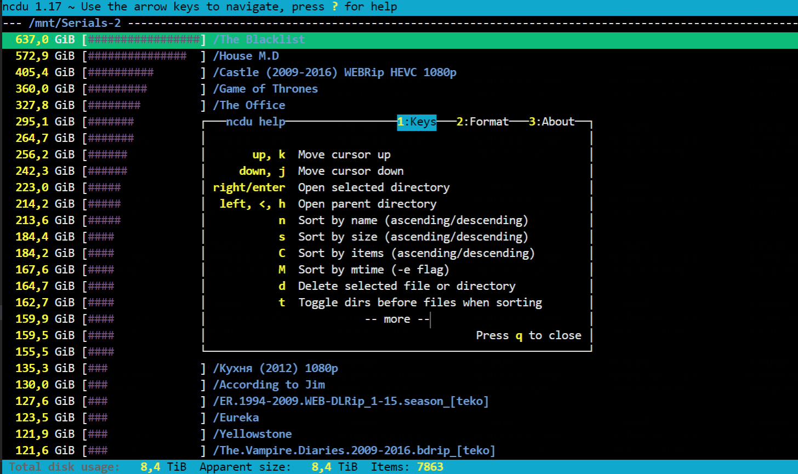

# NCDU

Утилита ncdu: эффективный инструмент для борьбы с переполнением дискового пространства



Установить можно через apt: 

```
sudo apt install ncdu
```

## Список команд и ключей
Список команд и действий, которые можно выполнить при работе с утилитой:

- up (стрелочка вверх на клавиатуре), k — перемещение вверх;
- down (стрелочка вниз на клавиатуре), j — перемещение по списку вниз;
- enter — открытие нужной директории (папки);
- left (стрелочка влево (<) на клавиатуре), h — возвращение в предыдущую директорию.

Утилиту ncdu можно запускать со следующими ключами:

- -h Вспомогательное сообщение;
- -q Тихий режим, интервал обновления 2 сек;
- -v Отобразить версию утилиты;
- -x Та же самая файловая система;
- -r Режим чтения;
- --exclude PATTERN Исключает файлы, содержащие ОБРАЗЕЦ;
- -X, --exclude-from FILE Исключает файлы которые содержат какой-либо ОБРАЗЕЦ в ИМЕНИ_ФАЙЛА.

Ввод следующих букв в латинской раскладке клавиатуры в момент использования утилиты позволит достичь следующего результата:

- a — режим отображения (размер файла, занятое место на жестком диске);
- d — возможность удаления выбранного файла или директории;
- e — включение и отключение отображения скрытых файлов;
- g — режим отображения занятого места (в процентах/графически/оба варианта);
- i — показывает информацию выделенного объекта;
- n — сортирует по имени;
- q — выход из интерфейса;
- r — повторный расчет занимаемой дисковой квоты;
- s — сортировка по объему.